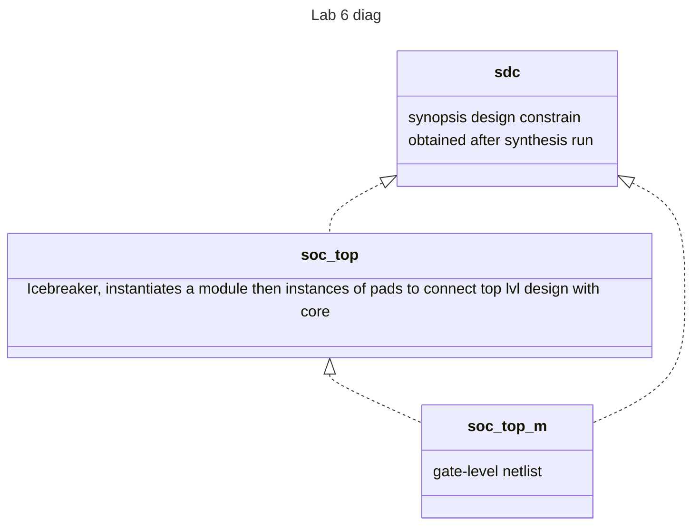

```mermaid
---
title: Lab 6 diag
---
classDiagram
	class sdc{
		synopsis design constrain
		obtained after synthesis run
	}
	class soc_top{
		Icebreaker, instantiates a module then instances of pads to connect top lvl design with core
	}
	class soc_top_m{
		gate-level netlist
	} 
		 
	sdc<|.. soc_top
	soc_top <|.. soc_top_m
	sdc<|.. soc_top_m
		
```
