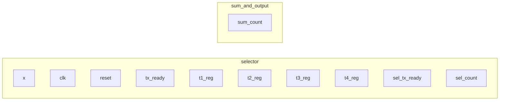

I want the four inputs (x1, x2, x3, and x4) to not be a vector but rather have 12 wires feeding in, with a two bit number selecting where these inputs should feed. The idea is to multiplex x1, x2, x3, and x4 into a parallel network of input wires which can toggle different registers for storing the rows. 

