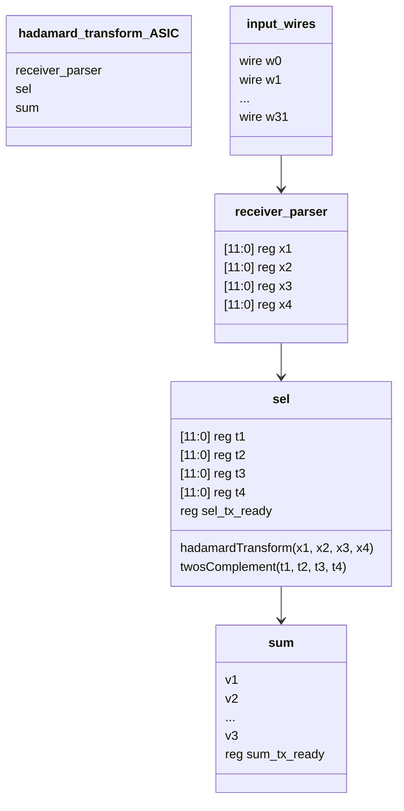

Can you create a left to right mermaid chart that describes an ASIC with following elements:
- 32 input wires. These can be grouped together, and labelled as one node if there is too much going on in the graph. They are titled as  `w0`, `w1`, and so forth.
- A `receiver_parser` subgraph. This takes in 32 input wires, and assigns four 12-bit register outputs of x1 through x4.
- A module titled `sel` that performs the hadamard transform and 2's complement on the four outputs from `receiver_parser`. It outputs four 12-bit registers t1-t4. It also has a `sel_tx_ready` register and a 4-bit `sel_count` register as an output

