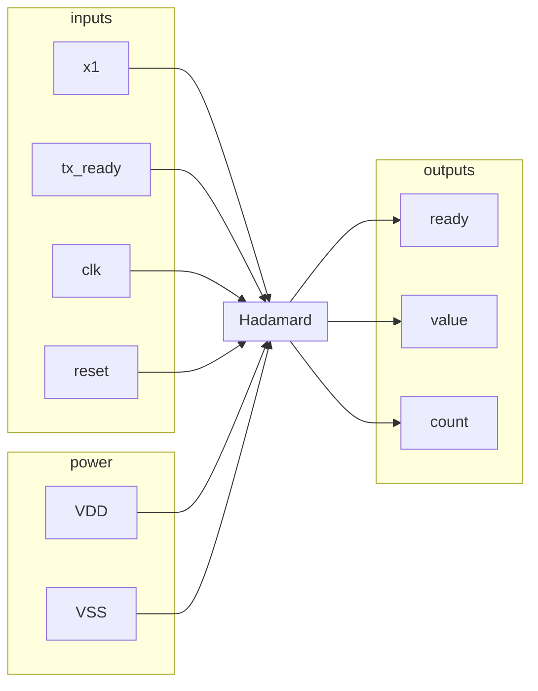

Why are there corner definitions? Do we need to do that?

Our understanding of what we need to do:
1. Rewrite our `hadamard_m.v` to be more consistent with the
2. Edit tcl to reference our `hadamard_m.v` correctly
3. Floorplanning edits:
	1. Edit .view
	2. Edit .io

The .globals sources the view file
- The config files have two things to change (sdc) and gate level net list

Answers
Manually insert the pads and Vdd because synthesis took it out

Place.io
- The corners will be the same
- They’re in clockwise order
	- The first one 
	- Clock needs to be somewhere in the middle 
		- This might show up with DRCs

Questions
1. Is the gds file created by innovus output?

