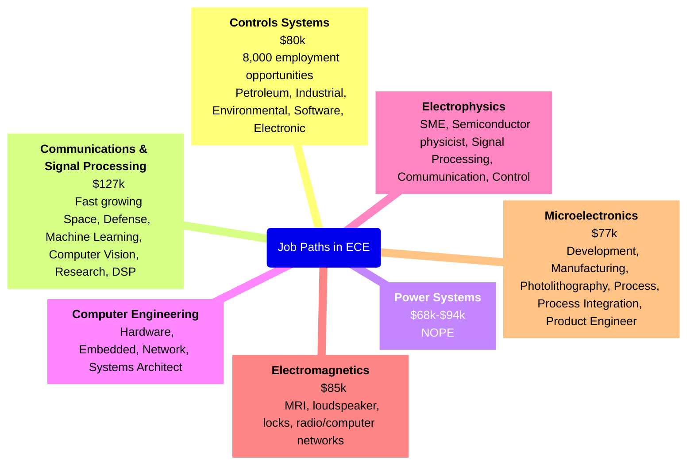
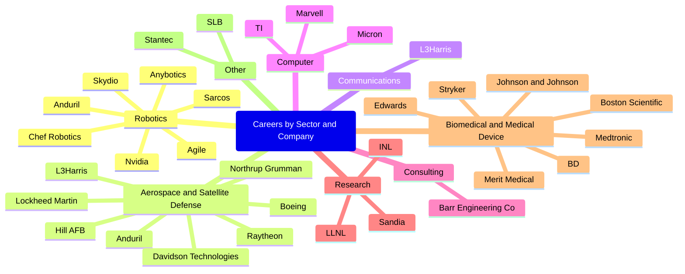
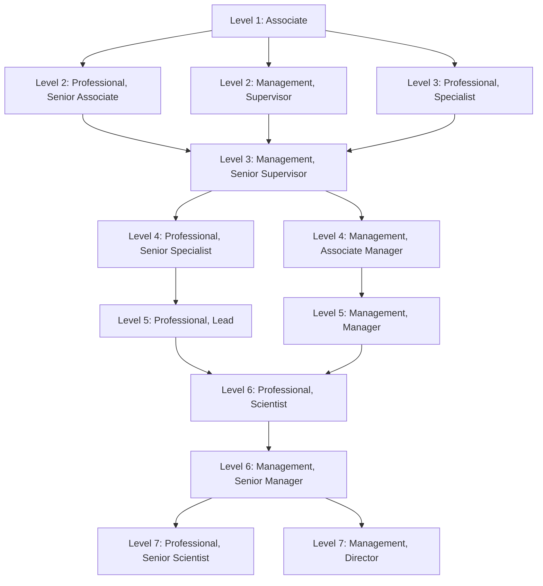

# Timeline

```mermaid
---
title: Jobs in ECE
---
mindmap
Root(Job Paths in ECE)
	controls[**Controls Systems**
	$80k
	8,000 employment opportunities
	Petroleum, Industrial, Environmental, Software, Electronic]

	communications[**Communications & Signal Processing**
	$127k
	Fast growing
	Space, Defense, Machine Learning, Computer Vision, Research, DSP]
	
	power[**Power Systems**
	$68k-$94k
	NOPE]

	computer[**Computer Engineering**
	Hardware, Embedded, Network, Systems Architect]

	electrophysics[**Electrophysics**
	SME, Semiconductor physicist, Signal Processing, Comumunication, Control]

	electromagnetics[**Electromagnetics**
	$85k
	MRI, loudspeaker, locks, radio/computer networks]

	microelectronics[**Microelectronics**
	$77k
	Development, Manufacturing, Photolithography, Process, Process Integration, Product Engineer]

```

```mermaid
---
title: Career Plan by Sector and Company
---
mindmap
	root(Careers by Sector and Company)
		Robotics
			Anduril
			Agile
			Nvidia
			Skydio
			Anybotics
			Chef Robotics
			Sarcos
		Aerospace and Satellite Defense
			Anduril
			Boeing
			Davidson Technologies
			Hill AFB
			Lockheed Martin
			L3Harris
			Northrup Grumman
			Raytheon
		Communications
			L3Harris
		Computer
			TI
			Micron
			Marvell
		Consulting
			Barr Engineering Co
		Research
			Sandia
			INL
			LLNL
		Biomedical and Medical Device
			Boston Scientific
			Edwards
			Johnson and Johnson
			Medtronic
			Merit Medical
			Stryker
			BD
		Other
			Stantec
			SLB
			
```

# Previous Charts
L3H Hierarchy

```mermaid
graph TD
  L1[Level 1: Associate]
  L2[Level 2: Professional, Senior Associate]
  L3[Level 2: Management, Supervisor]
  L4[Level 3: Professional, Specialist]
  L5[Level 3: Management, Senior Supervisor]
  L6[Level 4: Professional, Senior Specialist]
  L7[Level 4: Management, Associate Manager]
  L8[Level 5: Professional, Lead]
  L9[Level 5: Management, Manager]
  L10[Level 6: Professional, Scientist]
  L11[Level 6: Management, Senior Manager]
  L12[Level 7: Professional, Senior Scientist]
  L13[Level 7: Management, Director]

  L1 --> L2
  L1 --> L3
  L1 --> L4
  L2 --> L5
  L3 --> L5
  L4 --> L5
  L5 --> L6
  L5 --> L7
  L6 --> L8
  L7 --> L9
  L8 --> L10
  L9 --> L10
  L10 --> L11
  L11 --> L12
  L11 --> L13

```

