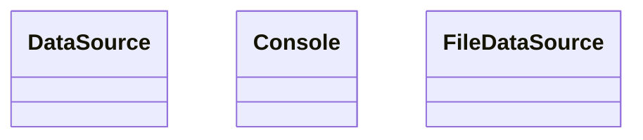

# OOP Design and Coding Guidelines
## SOLID
Single responsibility
- Make your code do one thing
Open/Closed
- You should only change existing code to fix bugs
	- Use inheritance to add features rather than rewriting old code
	- If you are writing an `if, else` statement, take a step back and see if you should be using inheritance/polymorphism
		- Refactoring, and all sorts of other stuff
- Requires you to think ahead
Liskov Substitution
- Objects in a program should be replaceable with instances of their subtypes without altering the 
- Its easy to write code right away, but you should write the header first.
	- Think about the interaction with other code, and write that first. Write that interface. 
	- It's easier to follow other principles if you follow that principle. 
Interface segregation principle
- Many client-specific interfaces are better than one general-purpose interface
- We want functions in an interface to be related (Cohesion)
Dependency inversion principle
- This has a whole training that we'll do later
- The glue that binds everything together
- Fixed hard-coded dependencies (inheritance) are there
	- Pointers are helpful for using 


# General Notes
VCP is the legacy software (Jim and Mike worked on this)
- They don't like the old software, but Keith who is their boss 
Stage is a class that performs actions on an image
Coax is a communication abstraction
There is a layer that sits right on top of the hardware
- Drives all the registers, and turns it into a common set of function calls above it. 
- If we put all of the software into that interface, it wouldn't work. 
- `AcquisitionInterface`
	- Only includes things that are specific to acquiring images across the panel
	- Nothing about reading temperature, network and other crap

# Toole Software Architecture Specification
[Docs](https://slfpbuildmstr/tooele/)
Not always dynamic, needs to be added sometimes. 

## Dependencies
If we want to change dependencies, it can sometimes be very difficult to change. 

Design patterns
- Things you do that are best practice, and used throughout
- Designs or implementation that people have that apply well to a variety of problems. 
	- An example is using 2x4 beams in houses. 
- Common design patterns have been given names
	- The gang of four design patterns put this together in a language-neutral ways. 

Factory = A design pattern
- You tell a factory what you want (i.e. a data source, type of data source, where it should be found) and it creates an instance of the data source. 
	- A nice way to break dependencies

Look into Microsoft .NET Runtime and a few other things like that. 

### Ways to implement factories
Abstract class
- A pure virtual method 
```cpp
class DataSourceInterface

{
public:
    static DataSourceInterface* factory(const std::string& type);
    virtual ~DataSourceInterface() {};
    virtual std::string getData() = 0; 
};
```
- In C++ we need to declare a virtual thing
- Not all classes in C++ are polymorphic
	- In order to make a polymorphic class, you must use `virtual` 
		- `Virtual` tells the compiler that this class may be defined within a compiler. 

```shell
git checkout origin/depends~~
```
- This is how `git` says "this is a branch on a remote server"



```cpp
DataSource* source = ::factory();
source -> getData();
```
- You may accidentally call `source`'s `getData()`
- Declare everything virtual method so you 
	- Put virtual on everything and you'll be fine.
	- EXTREMELY important to put virtual on the destructor of a class. 
- Always make things virtual so it can be polymorphic. 
	- Nanoseconds of performance as the pointers are already on the cache. 

Factories can get rid of dozens of if else statements by creating one specific instance.
- They don't solve all problems
	- Dependency injection
### Dependency Injection
- We want to keep things close to the top, and move the level where dependencies are required up and up. 
Dependency inversion
- Take dependencies that would normally be determined at the bottom towards the top. 
Derive a new datasource from datasource main
- Hardcoding dependencies in the class is sometimes the best way to have it. 

### Dependency Container
- This pattern didn't exist when the gang of four book came out
- Dependency containers are the next thing we do. 

### Inversion of Control
Determine dependencies at the top
- Dependencies are a directed graph from the top to the bottom in traditional software
	- Changing something at the bottom (within an object), has the potential to affect everything that depends on it
		- Flipping that architecture is MUCH better as it won't affect anything else
		- That way, you can change one class (or add a class) or any other object
- IOC container = service locator
- IOC is a component in the architecture
	- A big container of all the interfaces for that piece of software. 
- Up in main (or top level of program) that thing goes off and fills a container with the correct implementation of an interface
	- "I don't care what the object is that implements this interface, but give it to me"
		- All the dependencies that that code 
IOC is a container of classes that implement the interfaces. 
- There are THOUSANDS of examples of the IOC within the codebase. 

## Big picture
- Hardcoded dependencies are bad, use Factories, dependency injection, or IOC as a way to go around it
	- This makes software easier to maintain, and easier to implement. 


- [x] Read more about factories ✅ 2024-06-21

## Exception Handling
