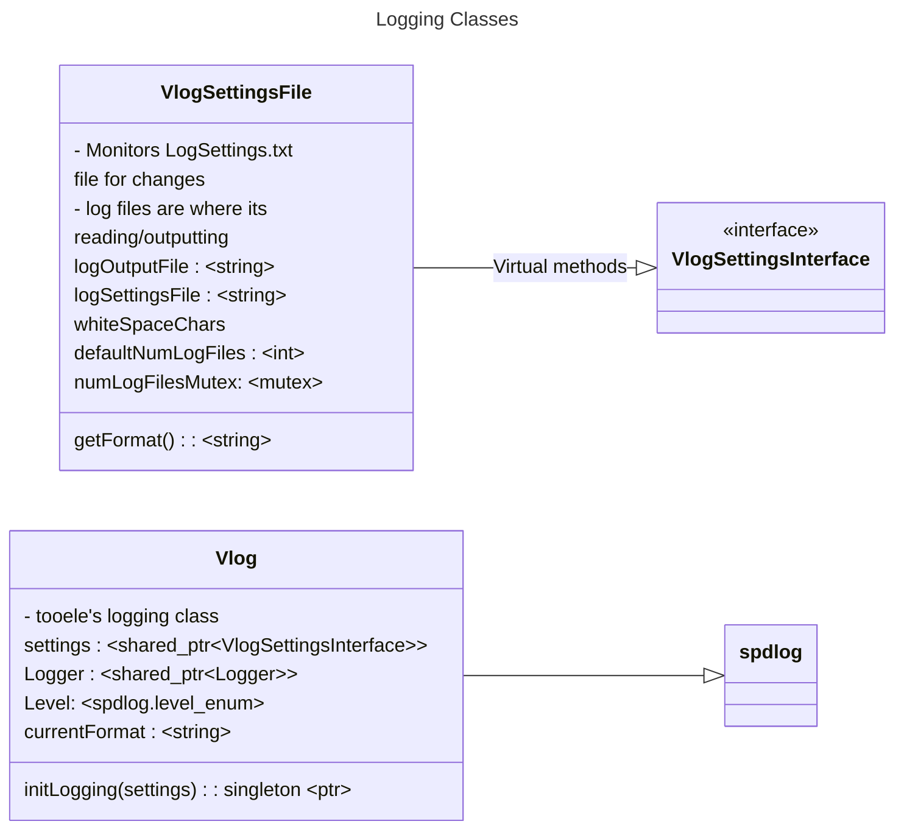
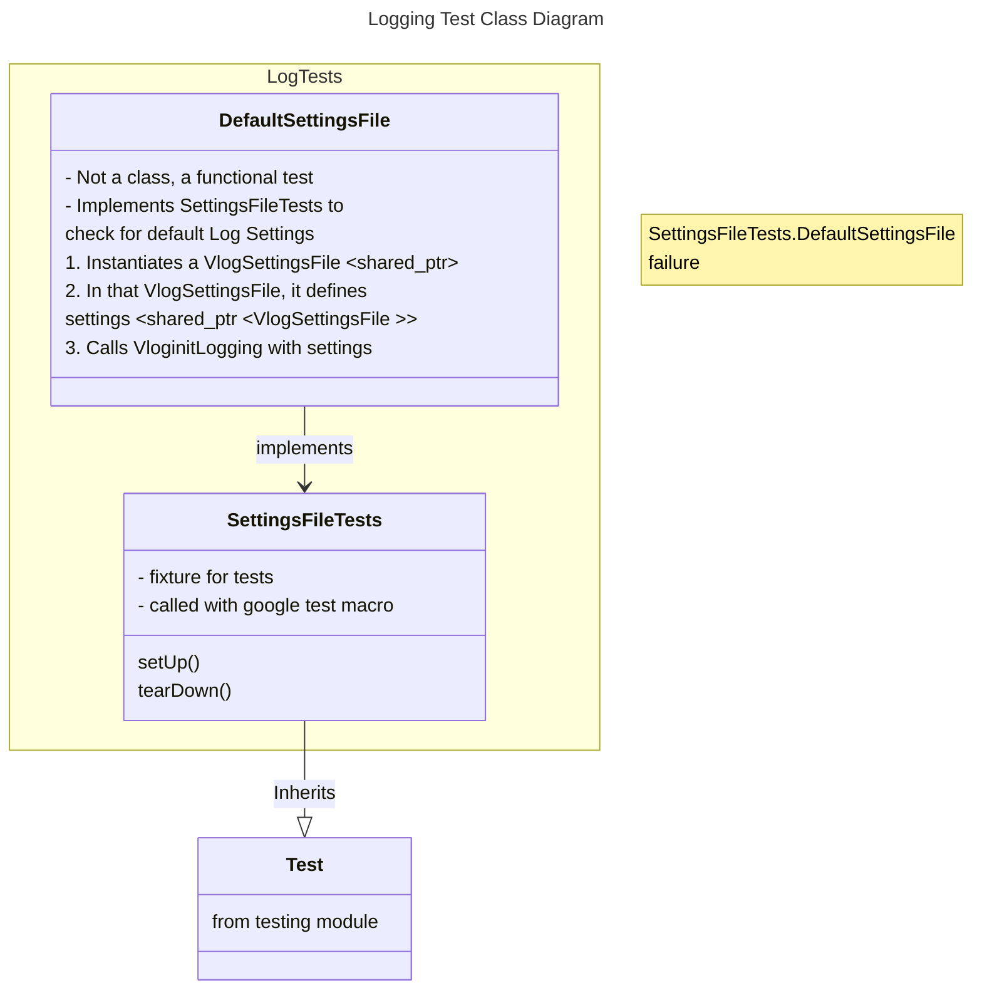
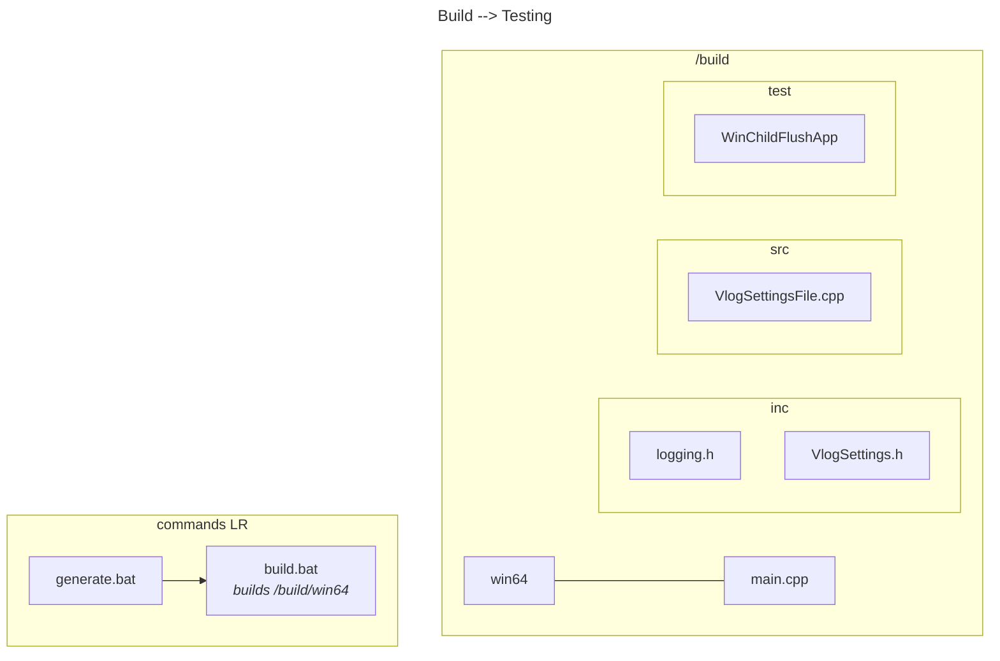

# Background
## Logging Classes

```mermaid
---
title: Logging Classes 
---
classDiagram
	direction LR
	
	class VlogSettingsFile{
		- Monitors LogSettings.txt
		file for changes
		- log files are where its
		reading/outputting
		logOutputFile : ~string~
		logSettingsFile : ~string~
		whiteSpaceChars
		defaultNumLogFiles : ~int~
		numLogFilesMutex: ~mutex~
		
		getFormat() : ~string~
	}
	
	class VlogSettingsInterface{
	    <<interface>>
	}
	VlogSettingsFile --|> VlogSettingsInterface : Virtual methods
	
	class Vlog {
		- tooele's logging class  
		
		settings : ~shared_ptr~VlogSettingsInterface~~
		Logger : ~shared_ptr~Logger~~
		Level: ~spdlog.level_enum~
		
		currentFormat : ~string~
		initLogging(settings) : singleton ~ptr~
	}
	Vlog --|> spdlog 
```

## Logging Tests

```mermaid
---
title: Logging Test Class Diagram
---
classDiagram
	direction TD
	class Test{
		from testing module
	}
	namespace LogTests{
		class SettingsFileTests{
			- fixture for tests
			- called with google test macro
			setUp()
			tearDown()
		}
		class DefaultSettingsFile {
			- Not a class, a functional test
			- Implements SettingsFileTests to
			check for default Log Settings

			1. Instantiates a VlogSettingsFile ~shared_ptr~
			2. In that VlogSettingsFile, it defines 
			settings ~shared_ptr ~VlogSettingsFile ~~
			3. Calls VloginitLogging with settings
		}
		}
	SettingsFileTests --|> Test : Inherits
	DefaultSettingsFile -->  SettingsFileTests : implements
	note "SettingsFileTests.DefaultSettingsFile
	failure"
```

##### `SettingsFileTests`
![[Pasted.image.20240530123538.png| 400]]
## Build to Testing

```mermaid
---
title: Build --> Testing
---
flowchart LR
	subgraph commands LR
		build["`build.bat
		*builds /build/win64*`"]
		generate["`generate.bat`"]
		generate --> build
	end
	subgraph "/build"
		build_folder["win64"]
		build_folder---win64_main["main.cpp"] 
		subgraph inc
			logging["logging.h"]
			vlogsettings["VlogSettings.h"]
		end
		subgraph src
			vlogsettings_file["VlogSettingsFile.cpp"]
		end
		subgraph test
			WinChildFlushApp["WinChildFlushApp"]
		end
	end
	build ~~~ build_folder
```
