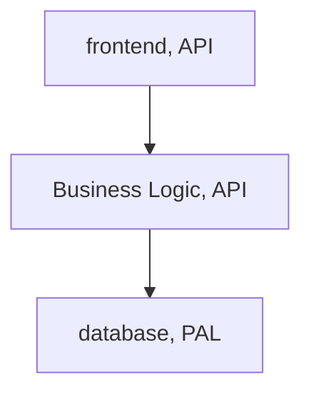

# Tooele High Level Design
[Detailed Design Wiki](http://slfpbuildmstr.vic.ad.vareximaging.com/jenkins/static-files/LYRu83Yf8LUUxkrOWETwaKx_aSm6lOLszUO-KORPBU93aTk5NDI2OToxNzE1MjA1NTI5NzM0OnZpZXcvVG9vZWxlL2pvYi9Ub29lbGUtRG9jdW1lbnRhdGlvbi9sYXN0U3VjY2Vzc2Z1bEJ1aWxkL2FydGlmYWN0/doxygen/html/design.html)

![[Pasted image 20240508160027.png|750]]
## Major Pieces of Design
- API Adapters
	- None of these APIs ever happened, and we're still stuck on Python. 
	- We basically have 2 API adapters, and one died. 
	- The ability to do it is there. 
- Common Receptor API (CRAPI)
	- CRAPI had a bigger job at one point, but these interface layers are very important
	- Isolate each of the three layers from another 
	- Especially meant to protect us from accidentally passing a hard pointer directly to OEM customer code. 
		- Gives us freedom to fix things without breaking customer stuff.
- Junk in the Middle (JIM)
- Panel Abstraction Layer API (PAPI)
	- Pal API
	- Just the headers
		- The ones we talked about in the Interface segregation
		- Responsible for talking to the hardware
	- Enable us to call functions at a high level, that are implemented below
		- Allows us to call abstractions of the panel beneath
	- 
- Panel Abstraction Layer (PAL)
	- Based on Windows HAL (hardware abstraction layer)
	- Handles getting images off of the sensor
	- Most important part of the whole system
		- Some parts of the PAL can be used in multiple ways
	- PAL gen 5, PAL gen 6
	- They only run on one OS, and usually only on the platform they're on. 
		- Everything else is cross-platform, except for this
- Support Components
	- Every box is a "component"
	- A component is the smallest piece you could break the code into and still have it do a task. 
		- Something might be "talk to hardware"
		- Exceptions, logs, events, config, IOC
			- Events are asynchronous notifications
			- They have their own exceptions within C++ (C# and Java have really nice stack traces)
			- Parameter parsing and stack tracing
	- A component is a SINGLE Gerrit repository
		- i.e. [software/tooele/support/transport](https://fpgit/#/admin/projects/software/tooele/support/transport)
		- [software/tooele/support/exceptions](https://fpgit/#/admin/projects/software/tooele/support/exceptions)
## General Notes
In this structure, function calls go down the architecture, and calls are returned back up

Asynchronous type events and notifications are another pattern, and a way for anything in the system to notify other components asynchronously. 
- `Observer` pattern
- A.k.a. `Subscriber` pattern
- `Signals` and `Slots` pattern in QT

## Enterprise system architecture
### MVC
- A way of layering things in software
- There are other ways of naming this stuff
- Frontend
- Business logic

## When you need help, try these ideas (in no particular order)
1. Give Jim around a day or two, then try the other one. 
2. Go check buildmstr for the docs
3. Ask Paul
4. 

