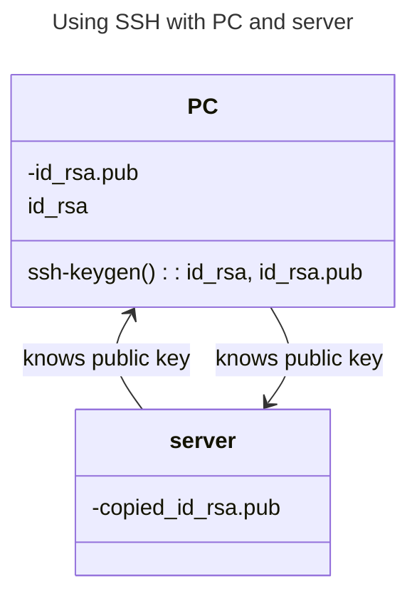

# Summary
`VIEW[**{summary}**][text(renderMarkdown)]`

## Public Key and Private Key

![[ssh-asymmetric-encryption.svg]]

# More Info
<iframe src="https://www.manageengine.com/privileged-access-management/what-is-ssh-secure-shell.html" style="width: 100%; height: 600px;background-color:white;"></iframe>

<iframe src="https://support.atlassian.com/bitbucket-cloud/docs/set-up-personal-ssh-keys-on-linux/" style="width: 100%; height: 600px;background-color:white;"></iframe>