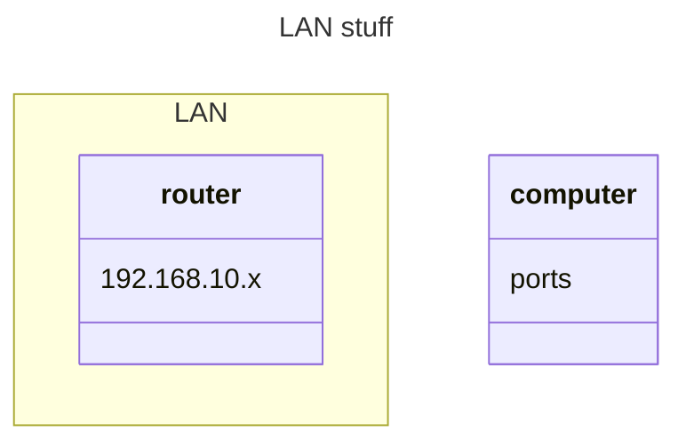

---
{}
---
---
{}
---
What are the protocols I should be aware of?

When I plug in an ethernet cable, I create a LAN between two computers. 
- How do I go about helping them to communicate?
- Ports?
- IP addresses on the LANs?
	- How do I set that with the Ubuntu software?
	- Are there other tools that I should use to set the addresses?

Basic wifi setup

![[Pasted image 20240303163958.jpg]]
- How do I change, access and interact with the TCP/IP protocol suite

0.0.0.0 is no address

Network manager is the Ubuntu gui version of the nmtui 

Find command on Linux is used a lot, so learn that

Reverse search