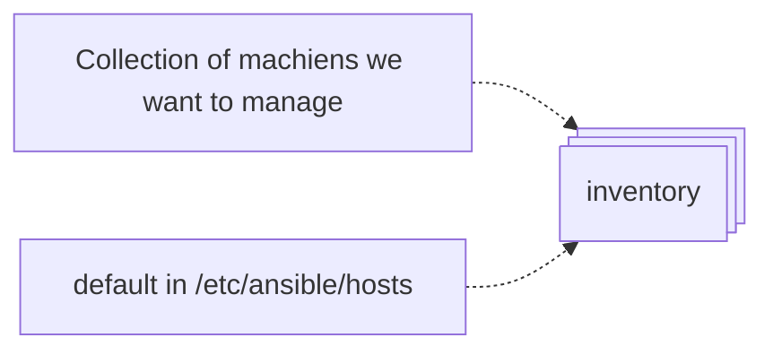

# Summary
`VIEW[**{summary}**][text(renderMarkdown)]`

# Additional Background
## Terminology
- **Inventory:** A collection of all the hosts and groups that Ansible manages. Could be a static file in the simple cases or we can pull the inventory from remote sources, such as cloud providers.
- **Host:** A remote machine managed by Ansible.
- **Group:** Several hosts grouped together that share a common attribute.
- **Modules:** Units of code that Ansible sends to the remote nodes for execution.
- **Tasks:** Units of action that combine a module and its arguments along with some other parameters.
- **​​Playbooks:** An ordered list of tasks along with its necessary parameters that define a recipe to configure a system.
- **Roles:** Redistributable units of organization that allow users to share automation code easier.
- **YAML:** A popular and simple data format that is very clean and understandable by humans.

## Concepts of Note

