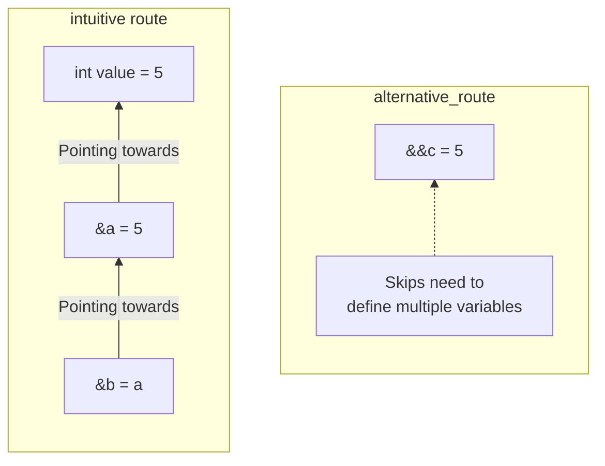

# Summary
`VIEW[**{summary}**][text(renderMarkdown)]`

# Additional Background
[Value categories - cppreference.com](https://en.cppreference.com/w/cpp/language/value_category.html)

## Concepts of Note

### rValues: data value already stored in memory
- Expression that *isn't* an lvalue. 
- Doesn't necessarily have any storage associated with it.
- Examples:
	- results of most operators, function calls that return nonreferences (`42 +13`). 

#### prvalue
"Pure" rvalue, computes value of an operand or initializes an object.
 - Result object may be avariable
 - Literals other than string (`42`, `true`, `nullptr`), `a++`, `a--`, Arithmetic expressions (`a+b`, `a%b`), Address-of expression (`&a`), `this`, An enumerator 

#### xvalue
"Expiring value" denotes an object whose resources can be reused

### lValues: object reference (&nameOfVar)
- Defined region of storage
- You can take its address
- Expression that yields an object reference 
- Examples include: 
	- Array subscript reference, dereferenced pointer, a function call that returns a reference.
		- `a = b`, `a.m`, `p->*mp`, `a ? b : c`, `a[n]`, `++a`
			- These are no longer lvalues when the thing is a member enumerator and/or a non-static member function.

##### Properties
- Address of an lvalue may be taken by built-in address-of operator
- Modifiable lvalue may be used as the left-hand operand of the built-in assignment/compound assignment operators
- Lvalue may be used to initialize an lvalue reference

#### gvalue
"Generalized" lvalue: expression that determines the identity of an object/function

### && (Universal Reference)
- Means you can hold both an l-value and an r-value reference.

## Usage
lValues
- Cannot be `const` when referring to other lvalues
- Can be `const` if it points to a 

### std::move
## Diagrams


## Examples

```cpp
int a = 10;

int& lref = a;
int&& rref = 20;
```