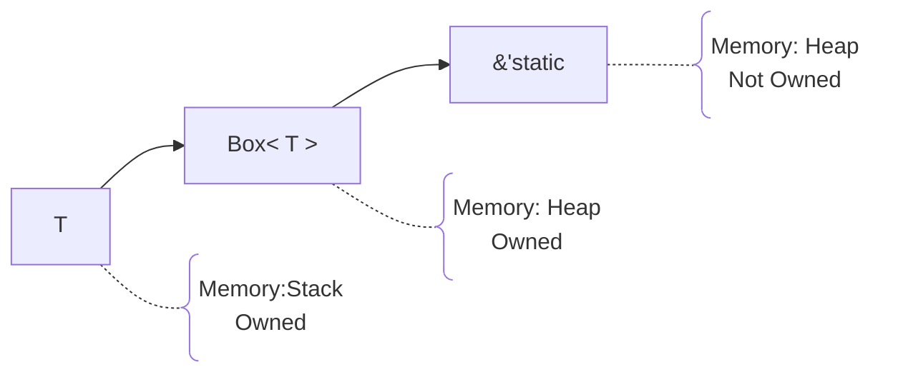

# Summary
`VIEW[**{summary}**][text(renderMarkdown)]`
# Additional Background
## Concepts of Note

You don't want to create a reference, and *then* promote it to the static lifetime. 
Instead, create a box, which contains a reference to a value on the heap.

## Diagrams
