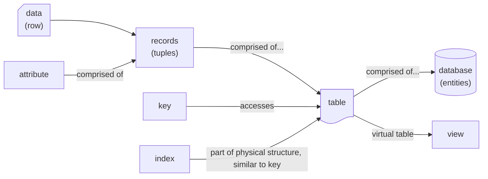

# Summary
`VIEW[**{summary}**][text(renderMarkdown)]`

# Additional Background
## Concepts of Note
Databases should be thought of as a collection of related files
A database management system (DBMS) helps manage the task to find the file.
Relational database models allow one file to be related to any other means of a common field.

Each table consists of rows and columns
- Data = values kept in the database
- Information = processed data
- Database = collection of tables
- 
- Row = Record
-  Attribute = Column
	- One piece of data that relates to the record (called a tuple)
- Field = An attribute when referring to a database table

## Media

Database Terminology
[Relational Databases: Basic Terms - MariaDB Knowledge Base](https://mariadb.com/kb/en/relational-databases-basic-terms/)