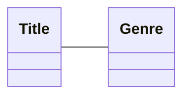
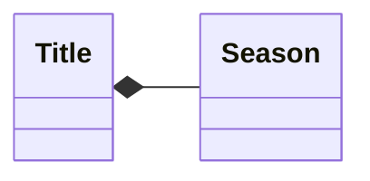
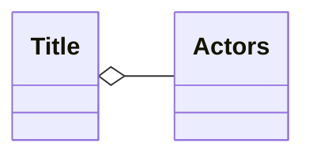
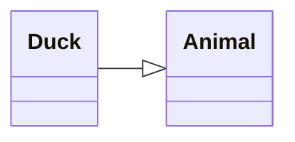
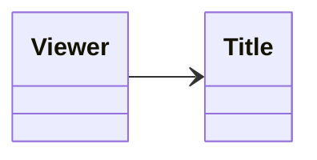
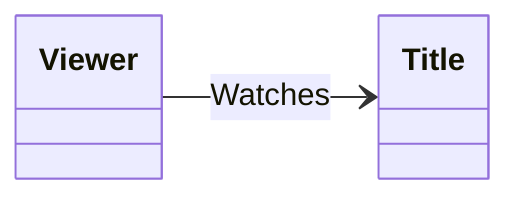
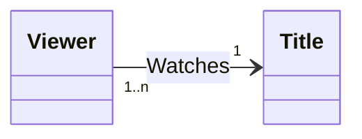

# Background
[Docs](https://mermaid.js.org/syntax/classDiagram.html)
[Good Thing to Look at](https://github.com/mermaidjs/mermaidjs.github.io/blob/master/classDiagram.md)

# Usage
## Syntax
### Element 
#### Classes
```
class A
class B{
	args
}
```
- I like to have a section above the members for notes (basically a bulleted list)
	- Not supported, but really nice. 

##### Methods
```
class A : get_info()
```
```
class A {
	method1 : ~string~
	method2 : ~list~
}
```

##### Members
```
class A : +info
```
Visibility
- `+` Public
- `-` Private
- `#` Protected
- `~` Internal

##### Class Annotations
###### Abstract
###### Enumeration
```
class color{
	<<enumeration>>
}
```

###### Interfaces
```
class A
<<interface>> A
```
```
class A{
	<<interface>>
	noOfVertices
	draw()
}
```

###### Service
#### Note
```
note "General note"
note for A "Note for class A"
```

### Namespace
```
namespace BaseShapes {
    class Triangle
    class Rectangle {
      double width
      double height
    }
}
Triangle -- Rectangle
```
- Note: You **CANNOT** define different relationships or noteswithin the namespace. 

### Relationships
#### ClassDiagram Relationships
Put parents on the left, children on the right

##### Bi-directional

```
Title -- Genre
```
- Loose relationship, where both entities are holding association to the opposite one. 
- Loosest type, and can exit independently on their own
- No lifecycles, no owners, entities using each other

##### Composition

```
Title *-- Season
```
- Tight ownership
- Parent-child relationship
	- Child cannot exist without parent
	- 

##### Aggregation

```
Title o--Actors
```
- Loose ownership
	- Actors can live without a particular title, but there's a loose ownership there

##### Inheritance

```
Duck --|>Animal
Film --|>Title
```
- A TV show or film implements a title
	- The arrow points towards the parent
	- All ducks are animals, but not all animals are ducks

##### Directional Association

```
Viewer --> Title
```
- Viewer watches title, but title does not know about viewer
This will print the type of relationship too...

#### Descriptive Text
Can be put on every relationship

```
Viewer --> Title : Watches
```

##### Multiplicity of Relations
- `1` Only 1
- `0..1` Zero or One
- `1..*` One or more
- `*` Many
- `n` n (where n>1)
- `0..n` zero to n (where n>1)
- `1..n` one to n (where n>1)
```
Viewer "1..n"--> "1" Title : Watches
```

- The viewer watches 1 to n shows, and the Title has 1 show. 

### Formatting
#### Labels
```
class Animal["Animal with a label"]
class Car["Car with *1 symbols"]
```

## Examples
#### Example [ClassDiagram](https://mermaid.js.org/syntax/classDiagram.html)
```
---
title: Animal example
---
classDiagram
	direction RL
    class Duck{
        +String beakColor
        +swim()
        +quack()
    }
    class Fish{
        -int sizeInFeet
        -canEat() : ~boolean~
    }
    class Zebra{
        +bool is_wild
        +run()
        List~int~ Stripes
    }
    note "From Duck till Zebra"
    Animal <|-- Duck
    note for Duck "can fly\ncan swim\ncan dive\ncan help in debugging"
    Animal <|-- Fish
    Animal <|-- Zebra
    Animal : +int age
    Animal : +String gender
    Animal: +isMammal()
    Animal: +mate()
```
