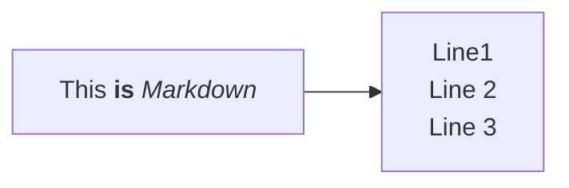

# Background


# Usage
## Titles
```
---
title: titleHere
---
```
## Mermaid formatting
### Markdown
- Note: does not work for classDiagrams
```
%%{init: {"flowchart": {"htmlLabels": false}} }%%
flowchart LR
    markdown["`This **is** _Markdown_`"]
    newLines["`Line1
    Line 2
    Line 3`"]
    markdown --> newLines
```


### Unicode
```
markdown["`This **is** _Markdown_`"]

unicode["This is unicode"]
```