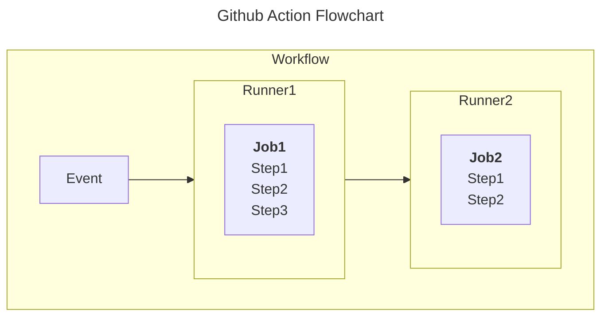

# Background
Continous integration and continuous delivery platform (CI/CD) that allows you to automate your build, test, and deployment pipeline. You can create workflows that build and test every pull request to your repository, or deploy merged pull requests to production. 

More background [here](https://docs.github.com/en/actions/learn-github-actions/understanding-github-actions): 



# Terms
## Workflows
Configurable automated process that will run one or more jobs. Defined by a `yaml` file and checked into your repository. In the `.github/workflows` directory. 


## Runners
A server that runs your workflows when they're triggered. GitHub provides: Ubuntu Linux, Microsoft Windows, and macOS runners. Each runner will trigger a new virtual machine. 

## Events
A specific activity in a repository that triggers a workflow run. This can be a pull request, opening an issue, or pushing a commit to a repository. 

## Jobs
A *set* of steps in a workflow that is executed on the same runner. You can share data from one step to another. 

Job dependencies can be configured with other job. 

## Action
Custom application for GitHub Actions platform that performs a complex but frequently repeated task. 

Actions can pull in git repo from GitHub, set up correct toolchain, or a variety of other processes. 

# Example Workflow File

```yaml
# Optional - The name of the workflow as it will appear in the "Actions" tab of the GitHub repository. If this field is omitted, the name of the workflow file will be used instead.
name: learn-github-actions
# Optional - The name for workflow runs generated from the workflow, which will appear in the list of workflow runs on your repository's "Actions" tab. This example uses an expression with the `github` context to display the username of the actor that triggered the workflow run. For more information, see "[AUTOTITLE](/actions/using-workflows/workflow-syntax-for-github-actions#run-name)."
run-name: ${{ github.actor }} is learning GitHub Actions

# Specifies the trigger for this workflow. This example uses the `push` event, so a workflow run is triggered every time someone pushes a change to the repository or merges a pull request.  This is triggered by a push to every branch; for examples of syntax that runs only on pushes to specific branches, paths, or tags, see "[AUTOTITLE](/actions/reference/workflow-syntax-for-github-actions#onpushpull_requestpull_request_targetpathspaths-ignore)."
on: [push]

# Groups together all the jobs that run in the `learn-github-actions` workflow.
jobs:

# Defines a job named `check-bats-version`. The child keys will define properties of the job.
  check-bats-version:

# Configures the job to run on the latest version of an Ubuntu Linux runner. This means that the job will execute on a fresh virtual machine hosted by GitHub. For syntax examples using other runners, see "[AUTOTITLE](/actions/reference/workflow-syntax-for-github-actions#jobsjob_idruns-on)"
    runs-on: ubuntu-latest

# Groups together all the steps that run in the `check-bats-version` job. Each item nested under this section is a separate action or shell script.
    steps:

# The `uses` keyword specifies that this step will run `v4` of the `actions/checkout` action. This is an action that checks out your repository onto the runner, allowing you to run scripts or other actions against your code (such as build and test tools). You should use the checkout action any time your workflow will use the repository's code.
      - uses: actions/checkout@v4

# This step uses the `actions/setup-node@v4` action to install the specified version of the Node.js. (This example uses version 14.) This puts both the `node` and `npm` commands in your `PATH`.
      - uses: actions/setup-node@v4
        with:
          node-version: '20'

# The `run` keyword tells the job to execute a command on the runner. In this case, you are using `npm` to install the `bats` software testing package.
      - run: npm install -g bats

# Finally, you'll run the `bats` command with a parameter that outputs the software version.
      - run: bats -v

```
