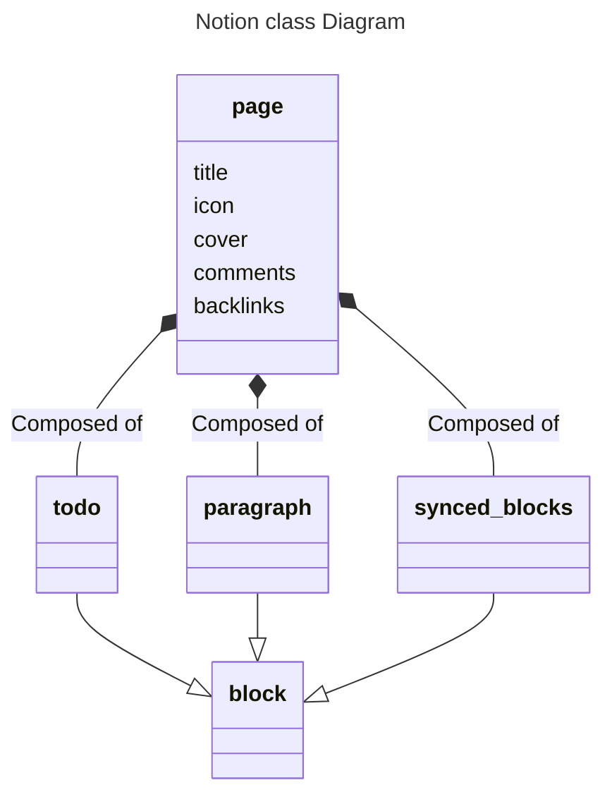

# Background
Everything in notion is stored within blocks. 
- There are over 90 blocks. You can create just about anything with these blocks. 

Pages can be nested within one another, and exist inside of databases

Blocks can be edited and turned into different types of blocks on the fly.
- Pages are essentially blocks, and you can use them to use other stuff. 
[Types of Blocks](https://thomasfrank.notion.site/Notion-Block-Reference-All-of-Notion-s-Blocks-8b40147600284c60b6f708e38f16ee68)

# Usage
