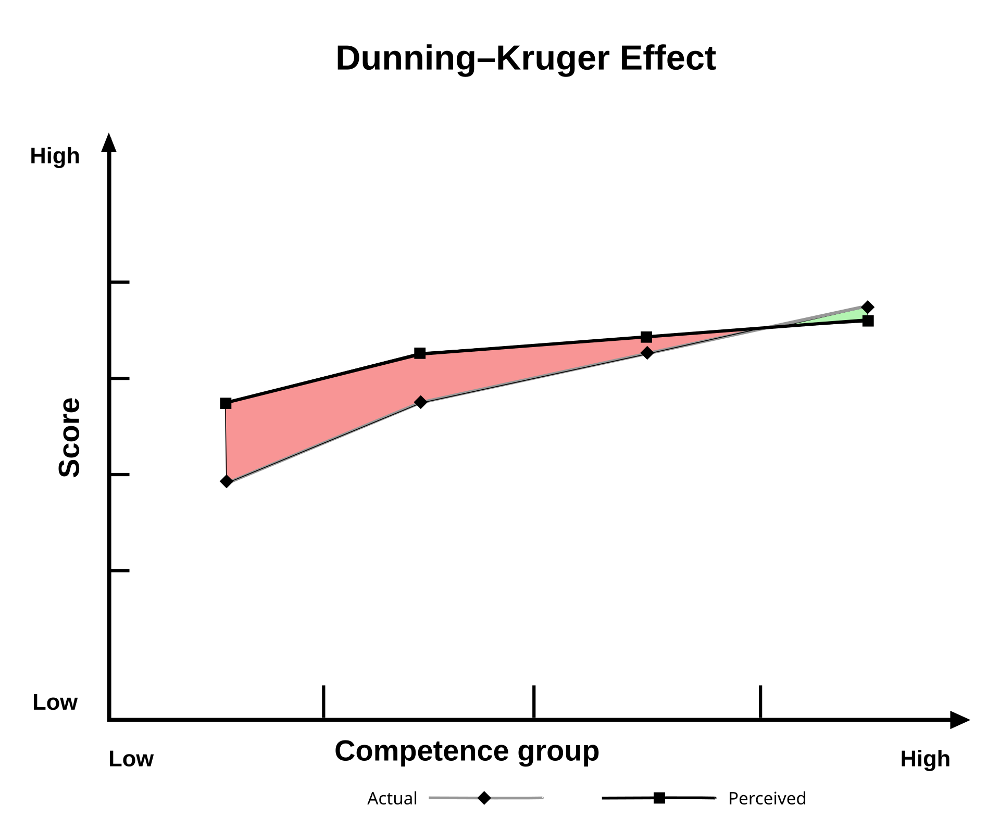
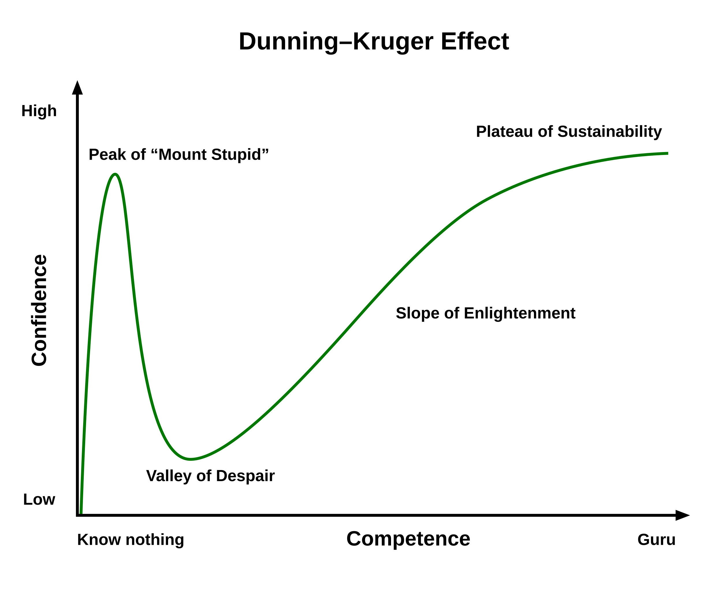

# Everything is More Complicated In Space
Will Graham
Embedded Software Engineer
Space Dynamics Laboratory

## Questions I want to ask?

* Spread of undergrad/grad students?
* Why are you all here?
	* Networking
	* To learn something
	* Hear about cool stuff happening around here
* What are you studying?

## Agenda/Outline

* Who am I, and why should you care?
	* Fun facts
* Challenges that space presents
* What does software engineering in space actually look like
* Frameworks that are helpful for transitioning towards the workforce
  * Kind vs wicked learning environments
  * Dunning-Kruger effect

# Who am I?

## Before Work

### Favorite things

* Sports
* Mountain Biking
* Local Restaurants
* Movies & TV
	* Love it all

### Randoms

* Grew up in Utah
* *Love* Kendrick Lamar
* Big fan of basketball, football (Go Utes)
* 4 knee surgeries, and can't wait to get another replacement
* Love to mountain bike
* My wife and I just welcomed our first child into the world (insert picture here)

## Education

* Olympus High School
* B.S. Mechanical Engineering, Emphasis in Dynamics and Control, University of Utah
* M.S. Electrical and Computer Engineering, Project Robotics Track, University of Utah

### Projects I had during my thesis

FSAE Go-kart
Mobile Motion Capture, using Heterogeneous Robotic Platforms
Mobile Heterogeneous Swarm Motion Planning

### What did I learn?

## Jobs

Research Assistant
L3Harris
Stryker Neurovascular
Sugarpost Metal Art
Varex Imaging

## What do I work on?

I work on flight software which is embedded aboard a satellite
You can almost describe what I do as a plumber
* I make sure information from various components talk to each other in a nice and orderly fashion. 
Day to day, this looks

# Challenges that Space Presents

(presenting the next series of things as questions)
The idea is you think alongside me, that way it's more interactive.

### Terminology

GEO = geostationary orbit
NORAD = North American Aerospace Defense Command

### Launch

* How will your component survive launch? How many G's can it withstand? Vibration tolerances for sensitive equipment?
* What if your components are behaving differently in orbit? Did you perform classifications before launch to deal with this problem?
  * 1990 Hubble telescope
* How will you transition from launch vehicle into orbit?

### Communication

* How will you communicate with ground? Do you have a radio that can communicate back down to earth?
* Do you plan to use a distributed array of, or just one?
* Do you need one giant radio dish, or can it be an array? How will you mimic the large dish with a distributed array?

### Space Debris

Kessler syndrome
* After Sputnik, NORAD started collecting a database of all known rocket launches and objects reaching orbit.
* Donald J. Kessler  and Burton Cour-Palais co-authored a studied demonstrating that colliding objects in LEO would cause a similar debris field as that found in the Asteroid belt in decades rather than billions of years.
* 
* May of space debris. There are two major debris fields, the ring in GSO, and the cloud of objects in LEO.

### GNC

* Satellites wobble in their trajectory
* How do you balance the onboard 
* Torque rods
Ionic 
Navigation...?

### Heating/Cooling

Temperature swings in space go from -220 C to 240 C.
Current methods for small spacecraft from NASA:
* Passive
	* Sprayable thermal coatings, tapes, and MLI
	* Thermal straps
	* Thermal contact conductance
	* Sunshields
	* Thermal louvers
	* Deployable radiators
	* Heat pipes
	* Phase change materials and thermal storage units
	* Thermal switches
	* Multifunctional thermal switches
* Active 
	* Heaters
	* Cryocoolers
	* Thermoelectric coolers
	* Fluid loops

### Power

Batteries
Electrochemical sources

Most satellites today rely on advanced solar cells (~30% efficiency) and Lithium-ion batteries.
This works until we get past Jupiter(according to https://www.esa.int/Enabling_Support/Space_Engineering_Technology/Power_Systems). At that point, the solar flux isn't great enough to power much. 
* That 30% efficiency doesn't hold over time

## Radiation

What is radiation and why is it harmful?
Earth
* X-rays
* Gamma rays
* Streams of protons/electrons
Radiation at various levels

### Particles from earth's magnetic field and the Van Allen Belt

* Ionizing radiation in the form of energetic protons, or collisions between GCR and atoms of Earth's atmosphere.
* During extremem events, trapped electron fluxes can increase by orders of magnitude, leading to increased risk of damage. 
	* Degrades solar panels
	* Wears electronics
	* Bit flips

### Galactic cosmic rays (high-energy protons and heavy ions from outside solar system)

* Ionizing radiation is very bad, knocks crap out of material
* Comes mostly from the Milky Way Galaxy
	* Traveling nearly at the speed of light.
	* 

"Try putting your computer in the microwave, and see if it still works"

### Radiation's effect on computing prices

  * Raspberry Pi 5 Compute 
    * Gigabit Ethernet
    * 32GB onboard memory, 4 GB RAM, 64-bit quad-core processor
    * $75
  * Intel Core i9-14901TE CPU (14th gen)
    * 5.3 GHz
    * 16 threads
    * 45 W
    * 8 core
    * $432.99
* RAD750
  * 110 * 200 MHz
  * Based on the PowerPC 750 architecture, which is what is similarly in a Mac from 2001
   * (https://www.theverge.com/tldr/2021/3/2/22309412/nasa-perseverance-mars-rover-processor-cpu-imac-1998)
  * Sources (wikipedia) say this is more than $200,000

## When do you do when something goes wrong?

This isn't something that you can plug your keyboard into and hope it works
Good LUCK getting an ethernet cord up there

### What effect has failure had on the space industry

# Day to day workflow

## Tickets and Projects

Tickets I'm working through
* GNC, data parsing, hardware setups.

I dive into as much documentation as SDL has 

## A severe lack of the yellow brick road

Problems don't solve themselves
In group projects, members of your team don't receive the same "grade"

# Space is more complicated than you think it is

## Kind and Wicked Learning environments

* Kind learning environment characteristics
  * Feedback is obvious
  * Feedback is quick
  * All the information is available
  * Feedback is accurate
* Wicked learning environments
  * Feedback may reinforce the wrong behavior
  * Some information is wicked
  * Some feedback may be delayed

## Dunning Kruger Effect

In 1999, David Dunning and Justin Kruger published a study on the relationship between perceived competence and actual competence across a variety of domains.
Specific overconfidence of people unskilled at a particular task
I'm *sure* you can think of someone in your life who you would like to read this study
* You should also know that this study applies to people who have had this exact same conversation. People who are aware of this effect, still experience it. The lesson here is to be cautions and humble when talking about 

## What did my recent introduction to the workplace teach me

I knew about the Dunning-Kruger effect, and I wanted to avoid it.

