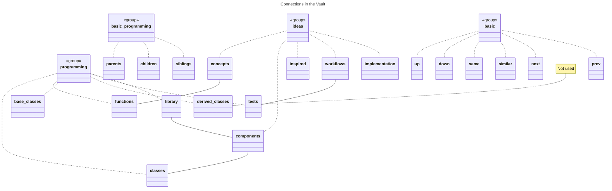

```mermaid
---
title: Connections in the Vault
---
classDiagram
    class programming{
    <<group>>
    }
    class ideas{
    <<group>>}
    class basic_programming{
    <<group>>
    }
    class basic{
    <<group>>
    }
    programming .. classes
    programming .. functions
    programming .. base_classes
    programming .. derived_classes
    programming .. tests
    programming .. library
    ideas .. concepts
    ideas .. components
    ideas .. inspired
    ideas .. workflows 
    ideas .. implementation
    basic_programming .. parents
    basic_programming .. children
    basic_programming .. siblings
    basic .. up
    basic .. down
    basic .. same
    basic .. similar
    basic .. next
    basic .. prev
    %% classes -- concepts
    %% components -- classes
    workflows -- tests
    concepts -- functions
    components -- classes
    library -- components

    note for derived_classes "Not used"
    
```
