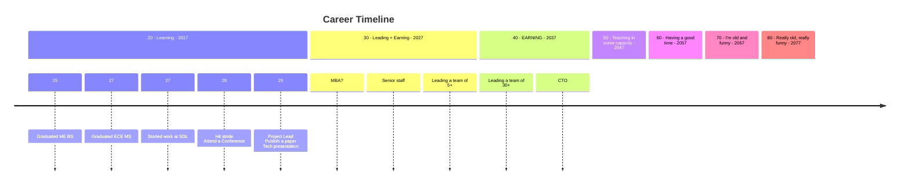

---
summary:
type:
headings:
date created: Friday, January 9th 2026, 10:38:44 am
date modified: Monday, January 12th 2026, 9:23:22 am
template: "[[base_note_template]]"
template-version: 1.0.1
---

# Summary
`VIEW[**{summary}**][text(renderMarkdown)]`

# Additional Background

