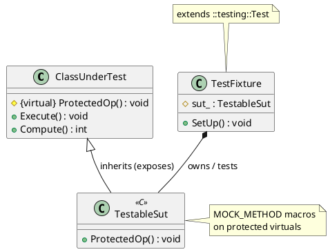

---
summary:
type: note/concept
headings:
  - "[[#Concepts of Note]]"
  - "[[#Examples]]"
similar:
  - "[[DP Testing Dependency Injection]]"
ai_generated: true
aliases: [CS Testing Mocking]
associations:
  - "[[Cpp protected]]"
date created: Tuesday, November 5th 2024, 2:59:17 pm
date modified: Tuesday, April 14th 2026, 2:20:49 pm
id: DP Testing Mocking
implementations:
  - "[[Cpp gTest Mocking Workflow]]"
item_of:
  - "[[Design Patterns]]"
tags: []
template: "[[base_note_template]]"
template-version: 1.0.2
---

# Summary
󰙎 DP Testing Mocking ;;; An object that implements the same interface as a real object, but lets you specify at runtime what it will do and how it will be used. Pre-programmed objects with expectations, which form a specification of the calls they are expected to receive.

# Additional Background
## Diagrams


## Examples
### Composition 
![[mocking-composition.svg | 400]]

### Inheritance (Mock Inherits Concrete)
![[mocking-inheritance.svg | 400]]

##### Code %% fold %% 
```cpp
// Dependency - concrete class with virtual methods (no interface extracted)
class Dependency {
public:
    virtual ~Dependency() = default;
    virtual void DoThing() {}
    virtual int GetValue() const { return 0; }
};

// ClassUnderTest - depends on Dependency via injection
class ClassUnderTest {
    Dependency* dep_;
public:
    explicit ClassUnderTest(Dependency* dep) : dep_(dep) {}
    void Execute() { dep_->DoThing(); }
    int Compute() { return dep_->GetValue() * 2; }
};

// MockDependency - inherits concrete class, overrides virtual methods
class MockDependency : public Dependency {
public:
    MOCK_METHOD(void, DoThing, (), (override));
    MOCK_METHOD(int, GetValue, (), (const, override));
};

// Fixture - same structure as injection; mock substitutes via inheritance, not interface
class TestFixture : public ::testing::Test {
protected:
    void SetUp() override {
        sut_ = std::make_unique<ClassUnderTest>(&mock_);
    }
    MockDependency mock_;
    std::unique_ptr<ClassUnderTest> sut_;
};

// Tests
TEST_F(TestFixture, ExecuteCallsDoThing) {
    EXPECT_CALL(mock_, DoThing()).Times(1);
    sut_->Execute();
}

TEST_F(TestFixture, ComputeReturnsDoubleValue) {
    EXPECT_CALL(mock_, GetValue()).WillOnce(Return(5));
    EXPECT_EQ(sut_->Compute(), 10);
}
```

### Inheritance (Fixture Inherits SUT)

![[DP Testing Mocking.png | 800]]


##### Code %% fold %% 
```cpp
// ClassUnderTest - has protected virtual hook methods
class ClassUnderTest {
public:
    void Execute() { ProtectedOp(); }
    int Compute() { return ProtectedOp(), 42; }
protected:
    virtual void ProtectedOp() {}
};

// TestableSut - subclass that mocks protected virtuals
class TestableSut : public ClassUnderTest {
public:
    MOCK_METHOD(void, ProtectedOp, (), (override));
};

// Fixture - owns TestableSut; no separate mock needed
class TestFixture : public ::testing::Test {
protected:
    TestableSut sut_;
};

// Tests
TEST_F(TestFixture, ExecuteCallsProtectedOp) {
    EXPECT_CALL(sut_, ProtectedOp()).Times(1);
    sut_.Execute();
}
```

