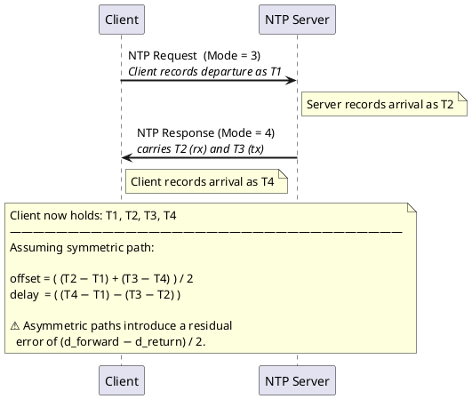

# Summary
`VIEW[**{summary}**][text(renderMarkdown)]`

# Additional Background
[NIST Internet Time Service](https://tf.nist.gov/tf-cgi/servers.cgi)

[pool.ntp.org: the internet cluster of ntp servers](https://www.ntppool.org/en/)
- pool.ntp.org provides an NTP server for millions of clients. Default "time server" for many major Linux distributions and networked appliances.

RFC 5905 — NTPv4 specification (supersedes NTPv3/RFC 1305).

## Concepts of Note

### Stratum
󰙎 Stratum ;; A hierarchical ranking (0–15) describing a clock's distance from a reference time source. Stratum 16 means unsynchronized.

| Stratum | Description |
| ------- | ----------- |
| **0** | Reference clock (GPS, atomic, radio) — never transmitted directly over the network |
| **1** | Directly connected to a stratum-0 source (primary servers) |
| **2–15** | Each hop from a lower-stratum server adds 1 |
| **16** | Unsynchronized / unreachable |

󰙎 Reference Clock ;; A high-precision external time source (GPS, atomic clock, PPS signal) physically connected to a stratum-1 server. Never communicates over the network directly.

### Clock Discipline
󰙎 Clock Discipline ;; The NTP algorithm that continuously steers the local clock's frequency and phase toward the server. Uses a hybrid PLL/FLL — phase-locked loop for short-term corrections, frequency-locked loop for long-term drift.
󰙎 Offset ;; Estimated difference between the local clock and the server clock: `offset = ((T2 − T1) + (T3 − T4)) / 2`
󰙎 Round-trip Delay ;; Total network round-trip time for an NTP exchange: `delay = (T4 − T1) − (T3 − T2)`
󰙎 Jitter ;; Short-term variation in measured offset values. High jitter degrades synchronization quality.
󰙎 Dispersion ;; Maximum expected clock error, accumulated across stratum hops. Represents the "worst case" uncertainty.
󰙎 Poll Interval ;; How often a client queries a server, expressed as a power of 2 (e.g., `poll 6` = 64 s). Adjusts dynamically based on stability.
󰙎 iburst ;; On startup, send a burst of 8 packets back-to-back to quickly establish an initial offset estimate before settling into normal polling.

### NTP Packet (64-byte UDP, port 123)
| Field | Bits | Description |
| ----- | ---- | ----------- |
| LI | 2 | Leap second indicator |
| VN | 3 | Version (4 for NTPv4) |
| Mode | 3 | 1=sym-active, 3=client, 4=server, 5=broadcast |
| Stratum | 8 | Stratum level of the sender |
| Poll | 8 | Log₂ of poll interval in seconds |
| Precision | 8 | Log₂ of clock precision in seconds |
| Root Delay | 32 | Round-trip delay to stratum-0 source |
| Root Dispersion | 32 | Max clock error relative to stratum-0 |
| Reference ID | 32 | ID of the sync source (IP or ASCII tag) |
| Reference Timestamp | 64 | Time of last clock update |
| Origin Timestamp (T1) | 64 | Client send time (echoed from request) |
| Receive Timestamp (T2) | 64 | Server receive time |
| Transmit Timestamp (T3) | 64 | Server send time |

T4 is recorded by the client on receipt — not carried in the packet.

## Diagrams



## Configuration

### ntpd — `/etc/ntp.conf`
```conf
# Pool servers (iburst = fast initial sync)
pool 2.ubuntu.pool.ntp.org iburst

# Local clock fallback at low stratum (used if network is lost)
server 127.127.1.0
fudge  127.127.1.0 stratum 10

# Drift file — records frequency error across reboots
driftfile /var/lib/ntp/ntp.drift

# Restrict access
restrict default nomodify nopeer noquery notrap
restrict 127.0.0.1
restrict ::1
```

### chronyd — `/etc/chrony.conf` *(preferred on modern Linux)*
```conf
pool 2.debian.pool.ntp.org iburst maxsources 4

driftfile /var/lib/chrony/drift

# Step the clock on the first 3 updates if offset > 1 s; slew afterward
makestep 1.0 3

# Sync hardware clock from system clock periodically
rtcsync

logdir /var/log/chrony
```

### systemd-timesyncd — `/etc/systemd/timesyncd.conf`
```ini
[Time]
NTP=pool.ntp.org
FallbackNTP=time.cloudflare.com
```
> Lighter than ntpd/chronyd; suitable for clients that don't need to serve time.

### Diagnostics / Commands
| Command | Description |
| ------- | ----------- |
| `timedatectl status` | Show sync status and active time source |
| `timedatectl set-ntp true` | Enable NTP sync via systemd |
| `ntpq -p` | List ntpd peers with offset, jitter, and reach |
| `ntpstat` | Summary sync status (ntpd) |
| `chronyc sources -v` | List chrony sources with detail |
| `chronyc tracking` | Show clock tracking stats (offset, freq error) |
| `chronyc makestep` | Force an immediate clock step |

## Examples

### Minimal NTP Client in C++
Sends one NTP request packet over UDP, records T1/T4 locally, parses T2/T3 from the response, then computes clock offset and round-trip delay.

```cpp
#include <arpa/inet.h>
#include <cstring>
#include <ctime>
#include <iostream>
#include <netdb.h>
#include <sys/socket.h>
#include <unistd.h>

// Seconds between NTP epoch (Jan 1 1900) and Unix epoch (Jan 1 1970)
static constexpr uint32_t NTP_DELTA = 2'208'988'800u;

struct NtpPacket {
    uint8_t  flags;            // LI(2) | VN(3) | Mode(3)
    uint8_t  stratum;
    uint8_t  poll;
    int8_t   precision;
    uint32_t rootDelay;
    uint32_t rootDispersion;
    uint32_t refId;
    uint32_t refTm_s,  refTm_f;
    uint32_t origTm_s, origTm_f; // T1 (echoed from request by server)
    uint32_t rxTm_s,   rxTm_f;  // T2 — server receive time
    uint32_t txTm_s,   txTm_f;  // T3 — server transmit time
};
static_assert(sizeof(NtpPacket) == 48);

int main() {
    const char* host = "pool.ntp.org";

    // Resolve hostname
    addrinfo hints{}, *res;
    hints.ai_family   = AF_INET;
    hints.ai_socktype = SOCK_DGRAM;
    if (getaddrinfo(host, "123", &hints, &res) != 0) {
        std::cerr << "DNS resolution failed\n";
        return 1;
    }

    int sock = socket(res->ai_family, res->ai_socktype, res->ai_protocol);

    // 2-second receive timeout
    timeval tv{2, 0};
    setsockopt(sock, SOL_SOCKET, SO_RCVTIMEO, &tv, sizeof(tv));

    // Build request: LI=0, VN=3, Mode=3 (client)
    NtpPacket pkt{};
    pkt.flags = 0x1b;

    // T1: record client send time, then transmit
    timespec t1{}, t4{};
    clock_gettime(CLOCK_REALTIME, &t1);
    sendto(sock, &pkt, sizeof(pkt), 0, res->ai_addr, res->ai_addrlen);
    freeaddrinfo(res);

    // T4: record client receive time
    if (recvfrom(sock, &pkt, sizeof(pkt), 0, nullptr, nullptr) < 0) {
        perror("recvfrom");
        close(sock);
        return 1;
    }
    clock_gettime(CLOCK_REALTIME, &t4);
    close(sock);

    // Convert NTP fixed-point timestamp to double (Unix seconds)
    auto toUnix = [](uint32_t sec, uint32_t frac) -> double {
        return static_cast<double>(ntohl(sec) - NTP_DELTA)
             + static_cast<double>(ntohl(frac)) / 4'294'967'296.0;
    };

    double T1 = t1.tv_sec + t1.tv_nsec / 1e9;
    double T2 = toUnix(pkt.rxTm_s,  pkt.rxTm_f);
    double T3 = toUnix(pkt.txTm_s,  pkt.txTm_f);
    double T4 = t4.tv_sec + t4.tv_nsec / 1e9;

    double offset = ((T2 - T1) + (T3 - T4)) / 2.0;
    double delay  = (T4 - T1) - (T3 - T2);

    std::cout << "Stratum : " << static_cast<int>(pkt.stratum) << "\n";
    std::cout << "Offset  : " << offset * 1000.0 << " ms\n";
    std::cout << "Delay   : " << delay  * 1000.0 << " ms\n";
    return 0;
}
```

**Compile:**
```bash
g++ -std=c++17 -o ntp_client ntp_client.cpp
```

## Questions
󰠗 What is the NTP epoch offset from Unix? ;; 2,208,988,800 seconds — the difference between Jan 1 1900 and Jan 1 1970.
󰠗 How does NTP calculate clock offset? ;; `offset = ((T2 − T1) + (T3 − T4)) / 2` — averages the one-way delays assuming a symmetric path.
󰠗 What stratum level does an atomic clock occupy? ;; Stratum 0 — but it never transmits directly. Stratum-1 servers connect to it physically.
󰠗 What is the difference between ntpd and chronyd? ;; chronyd handles intermittent connections and large initial offsets better (makestep), and is more accurate on modern hardware. Most current Linux distributions prefer chronyd.
󰠗 What does `iburst` do? ;; On startup, sends 8 packets back-to-back to get a quick initial offset estimate before settling into normal polling.
