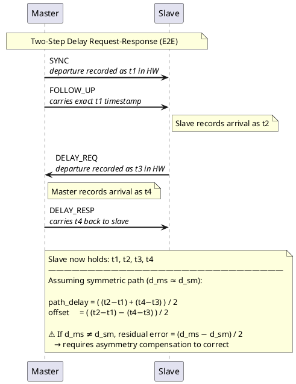

---
summary:
type: note/tool
headings:
  - "[[#Concepts of Note]]"
  - "[[#Diagrams]]"
  - "[[#Usage]]"
  - "[[#Questions]]"
implements:
  - "[[@ieee_1588]]"
classes:
  - "[[PTP Classes]]"
similar:
  - "[[NTP server]]"
prev:
  - "[[timespec]]"
aliases: []
date created: Friday, February 20th 2026, 1:55:23 pm
date modified: Wednesday, March 18th 2026, 12:00:00 pm
id: PTP Server
implementations:
  - "[[linuxptp]]"
item_of:
  - "[[Time and Time Servers]]"
tags: [cs/networking/protocols/time, ieee/1588]
template: "[[base_note_template]]"
template-version: 1.0.1
tools:
  - "[[linuxptp]]"
  - "[[phc2sys]]"
uses:
  - "[[Phase and Frequency Locked Loop]]"
  - "[[POSIX.1b]]"
---

# Summary
󰙎 PTP (IEEE 1588) ;; Network-based time synchronization standard. Aims to achieve nano-second or even pico-second level sync. It is more accurate because it uses hardware stamping rather than software stamping. PTP devices will actually timestamp the amount of time that sync messages spend on each device.

# Additional Background
[IEEE SA - IEEE 1588-2019](https://standards.ieee.org/ieee/1588/6825/)
[Precision Time Protocol (PTP) Explained](https://networklessons.com/ip-services/precision-time-protocol-ptp-explained)

## Concepts of Note
󰙎 Grandmaster ;;; The "best" clock. Elected by other nodes.
󰙎 Stratum ;;; The level of clock. A level 1 server is synchronized with a level 0 server. Level 0 servers are atomic clocks.

### Timing Constructs
#### Peer-to-peer delay
󰙎 Mean link delay ;;; How long it takes for the delay to hit the clock?
Using the following sync loop

### PTP Hardware Interface
PTP hardware exposes a clock as a POSIX clock via `dev/ptpN` See [[Linux Filesystem Hierarchy#/dev/ptpN]]

### PTP Clock Classes
PTP Defines a Best Master Clock algorithm to elect which node is `Grandmaster`

| Class   | Meaning                                                                 |
| ------- | ----------------------------------------------------------------------- |
| **6**   | Synchronized to a primary reference (GPS, atomic). Grandmaster-capable. |
| **7**   | Formerly class 6, now out of lock — still usable but degraded           |
| **13**  | Synchronized to an application-specific time source                     |
| **52**  | Degraded form of class 13                                               |
| **135** | Default for ordinary clocks with no external reference                  |
| **165** | Slave-only clock (never becomes master)                                 |
| **187** | Slave with lost lock — staying as slave                                 |
| **248** | Default — no external time source. Most embedded nodes start here.      |
| **255** | Slave-only, never eligible as master                                    |
󰙎 Local PTP Clock ;;; Provides local estimate of the time of its Grandmaster Clock. Either physical or mathematical clock, provides PTP or ARB (arbitrary) time.
󰙎 Master clock ;;; Time source to which all other local PTP Clocks on the PTP path synchronize
󰙎 Message timestamp point ;;; Point within a PTP event message serving as a reference point in the message
󰙎 Ordinary clock ;;; PTP instance that has a single PTP port in its domain and maintains the timescale used in the domain. Can serve as a source of time (Master clock) or can be synchronized (Slave clock) to local PTP clock of a Boundary Clock or another Ordinary
󰙎 Slave clock  ;;; In the context of a single PTP Comms path, this is the local lock that synchronizes to the Local Clock of the Master PTP instance.
󰙎 Discipline a clock ;;; Actively control a local clock to synchronize its frequency and time with a high-accuracy reference clock.

### PTP Message Types

PTP defines two classes of message: **event** messages (hardware-timestamped) and **general** messages (not timestamped).

#### Common PTP Header (all messages)

Every PTP message begins with a 34-byte common header:

| Offset | Size | Field                               | IEEE 1588 Type                   |
| ------ | ---- | ----------------------------------- | -------------------------------- |
| 0      | 1    | `messageType` + `transportSpecific` | Nibble × 2                       |
| 1      | 1    | `versionPTP`                        | UInteger4                        |
| 2      | 2    | `messageLength`                     | UInteger16                       |
| 4      | 1    | `domainNumber`                      | UInteger8                        |
| 5      | 1    | `minorSdoId`                        | UInteger8                        |
| 6      | 2    | `flagField`                         | Octet[2]                         |
| 8      | 8    | `correctionField`                   | `TimeInterval` (×2^16 scaled ns) |
| 16     | 4    | `messageTypeSpecific`               | Octet[4]                         |
| 20     | 10   | `sourcePortIdentity`                | `PortIdentity`                   |
| 30     | 2    | `sequenceId`                        | UInteger16                       |
| 32     | 1    | `controlField`                      | UInteger8 (legacy)               |
| 33     | 1    | `logMessageInterval`                | Integer8                         |

󰙎 `correctionField` ;;; accumulates residence time and path asymmetry corrections; `TimeInterval` type (scaled ×2^16); transparent clocks add their residence time here
󰙎 `sourcePortIdentity` ;;; `PortIdentity` = `ClockIdentity` (8 B, EUI-64) + `portNumber` (2 B); uniquely identifies the sending port

#### Event Messages (hardware-timestamped)

| Message | messageType | Body fields beyond header |
|---|---|---|
| Sync | 0x0 | `originTimestamp` (`Timestamp`, 10 B) |
| Delay_Req | 0x1 | `originTimestamp` (`Timestamp`, 10 B) |
| Pdelay_Req | 0x2 | `originTimestamp` + `reserved` |
| Pdelay_Resp | 0x3 | `requestReceiptTimestamp` (`Timestamp`) + `requestingPortIdentity` (`PortIdentity`) |

#### General Messages (not hardware-timestamped)

| Message | messageType | Key body fields |
|---|---|---|
| Follow_Up | 0x8 | `preciseOriginTimestamp` (`Timestamp`) — carries exact t1 |
| Delay_Resp | 0x9 | `receiveTimestamp` (`Timestamp`) — carries t4; `requestingPortIdentity` |
| Pdelay_Resp_Follow_Up | 0xA | `responseOriginTimestamp` + `requestingPortIdentity` |
| Announce | 0xB | `originTimestamp` + `currentUtcOffset` + `grandmasterPriority1` + `grandmasterClockQuality` (`ClockQuality`) + `grandmasterPriority2` + `grandmasterIdentity` (`ClockIdentity`) + `stepsRemoved` |
| Signaling | 0xC | TLV-only body |
| Management | 0xD | TLV-only body |

󰙎 Announce message ;;; broadcast by master; carries `ClockQuality` and `ClockIdentity` so slaves can run BMCA to elect grandmaster
󰙎 Follow_Up message ;;; general (non-timestamped) message sent after Sync in two-step mode; carries the precise t1 `Timestamp` that the NIC captured at Sync egress

## Questions
󰠗 Whare are the steps for a PTP server's peer to peer networking? ;; 1. Clock source sends out a 'timestamp' to clock subscriber. 2. Clock source sends out another signal 'follow up'. 3. Subscriber sends back a 'delay request'. 4. Source responds with a 'response' 5. Offset between 1/2 and 3/4 is averaged. Subscriber clock is adjusted to fit synchronization and otherwise.
󰠗 Which PTP messages are event messages vs general messages? ;; Event: Sync, Delay_Req, Pdelay_Req, Pdelay_Resp — hardware timestamped. General: Follow_Up, Delay_Resp, Pdelay_Resp_Follow_Up, Announce, Signaling, Management — not hardware timestamped.
󰠗 What does the correctionField accumulate? ;; Residence time added by transparent clocks and path asymmetry corrections. It is a TimeInterval (×2^16 scaled ns) in the common PTP header.

## Diagrams
### Peer-to-peer diagram
![[PTP Server-1.png]]

### Delay request-response path length
![[PTP Server.png|600]]

## Usage
### Linux PTP Frame Path: Wire to Clock Discipline

The path a PTP Ethernet frame takes from NIC ingress to a clock correction in `ptp4l`:

 start:
1. **NIC ingress** — hardware captures RX timestamp into PHC-domain `struct timespec` at the moment the frame's Start-of-Frame delimiter crosses the MAC. This is `t2` for Sync or `t4` for Delay_Req.
2. **Kernel socket layer** — kernel delivers the frame via UDP socket (port 319 for event, 320 for general). The hardware timestamp is attached as `SCM_TIMESTAMPING` control message (`struct timespec[3]`); `ts[2]` is the raw HW timestamp.
3. **ptp4l recvmsg** — `ptp4l` calls `recvmsg` with `MSG_WAITFORONE`; parses `SCM_TIMESTAMPING` cmsg to extract `t2` (or `t4`). Converts `struct timespec` to `tmv_t` (nanoseconds as `int64_t`).
4. **TX timestamp retrieval** — for Sync/Delay_Req egress, `ptp4l` retrieves `t1`/`t3` by calling `recvmsg(MSG_ERRQUEUE)` after send — NIC places the TX hardware timestamp on the error queue.
5. **Offset and delay calculation** — `ptp4l` computes `path_delay` and `offset` from t1–t4 using `tmv_t` arithmetic (see diagram above).
6. **Clock servo** — offset is fed to a PI servo (or custom servo). The servo outputs a frequency/phase correction applied to the PHC via `clock_adjtime(clkid, &timex)` (ADJ_FREQUENCY / ADJ_OFFSET).
7. **phc2sys** — separately reads PHC via `clock_gettime(FD_TO_CLOCKID(fd))` and disciplines `CLOCK_REALTIME` to match, using `clock_adjtime(CLOCK_REALTIME, ...)`.
 end:

### Key Kernel Interfaces Used by ptp4l

󰙎 `clock_adjtime` ;;; POSIX extension (`adjtimex` syscall); adjusts PHC or CLOCK_REALTIME frequency/phase; used by ptp4l servo to discipline the PHC
󰙎 `CLOCK_TAI` ;;; Linux clock ID for TAI; introduced in kernel 3.10; aligns with PTP's native timescale; offset from CLOCK_REALTIME = current leap-second count
󰙎 `PTP_CLOCK_GETCAPS` ioctl ;;; queries PHC capabilities: max frequency adjustment (ppb), number of alarms/pins, one-pulse-per-second support
󰠗 What syscall does ptp4l use to steer the PHC frequency? ;; clock_adjtime (wraps adjtimex) with ADJ_FREQUENCY to apply ppb (parts-per-billion) corrections from the PI servo output.
󰠗 Why does ptp4l need both port 319 and 320? ;; 319 receives event messages (Sync, Delay_Req) that need hardware timestamps. 320 receives general messages (Follow_Up, Delay_Resp, Announce) that carry payload data but do not require timestamping.
