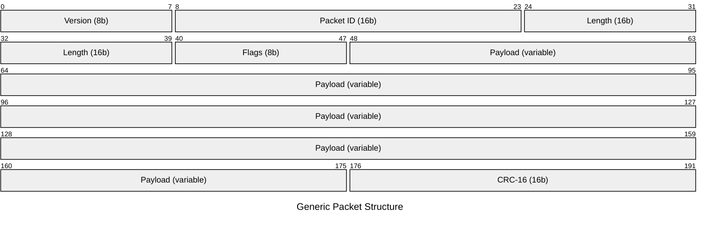
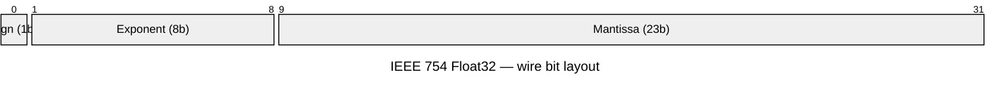
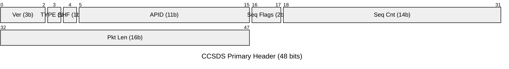

# Summary
󰙎 CS packet ;;; Group of information, implemented just about everywhere. Foundation of low level code.

# Additional Background

## Concepts of Note

### Packet anatomy

A packet is a contiguous byte buffer. Fields are located by **bit offset + bit size** and decoded according to endianness. The buffer carries **no type tags** — meaning is external.

󰙎 Header ;;; Fixed-width prefix carrying routing & framing metadata (version, ID, length)
󰙎 Payload ;;; Variable or fixed content; meaning determined by schema keyed on the ID field
󰙎 Trailer / CRC ;;; Optional suffix; integrity check computed over header + payload
󰙎 ID field ;;; Value that uniquely identifies the packet type; selects which schema to apply
󰙎 Endianness ;;; Byte order for multi-byte fields — `BIG_ENDIAN` (MSB first) or `LITTLE_ENDIAN` (LSB first)

### Datatype identification

The binary buffer carries no embedded type tags — the **schema** (your config file) is the sole source of type information.

**Resolution chain:**
1. Read ID field(s) at fixed, known offsets
2. Match ID value → packet schema (e.g. CCSDS APID → telemetry definition)
3. Apply schema: each field's `DATA_TYPE` dictates how to decode that bit range

| Data type | Encoding | Bit sizes |
|---|---|---|
| `UINT` | Unsigned binary | Any 1–64 |
| `INT` | Two's complement | Any 1–64 |
| `FLOAT` | IEEE 754 | 32 or 64 |
| `STRING` | ASCII bytes, null-padded | Multiple of 8 |
| `BLOCK` | Raw bytes (opaque) | Multiple of 8 |
| `DERIVED` | No binary presence | 0 (computed) |

󰙎 DERIVED ;;; Item with no bits on the wire; value computed from other items (e.g. timestamp delta, CRC result)
󰙎 Schema ;;; External definition mapping bit ranges → names + types; decoding is impossible without it

### Wire encoding

What travels on the wire is always raw bytes. Type determines how those bytes are packed:

| Type | Wire form | Notes |
|---|---|---|
| `UINT` | Unsigned binary | Byte order per endianness setting |
| `INT` | Two's complement | MSB=1 signals negative |
| `FLOAT` | IEEE 754 binary32/64 | 1 sign + 8/11 exp + 23/52 mantissa bits |
| `STRING` | ASCII, zero-padded to declared size | Trailing bytes are `0x00` |
| `BLOCK` | Verbatim bytes | No interpretation; use for embedded sub-packets |

󰙎 BIG_ENDIAN ;;; MSB at lowest address — `0x1234` → `[0x12, 0x34]`; default for space/network protocols
󰙎 LITTLE_ENDIAN ;;; LSB at lowest address — `0x1234` → `[0x34, 0x12]`; default for x86 memory
󰙎 Bit offset ;;; Distance in bits from packet start (MSB of byte 0 = offset 0); negative = from packet end

## Conversion

### Endianness

Swapping byte order of a 16-bit field `0x1234`: BE→LE reverses bytes → `0x3412`.

 `struct.pack('>HI', apid, length)` ;;; Python: pack uint16 + uint32, big-endian
 `struct.unpack_from('<f', buf, offset)` ;;; Python: read little-endian float32 from buffer at byte offset
 `ntohs(x)` / `htons(x)` ;;; C: network (BE) ↔ host byte order for 16-bit; `ntohl`/`htonl` for 32-bit
 `np.frombuffer(buf, dtype='>u2')` ;;; NumPy: parse big-endian uint16 array from bytes

### Type reinterpretation (type-pun)

Same bits, different type — **no value conversion**, only reinterpretation:

 `memcpy(&f, &u32, 4)` ;;; C: safe float/uint32 type-pun via memcpy (pointer cast is UB in C/C++)
 `np.frombuffer(buf, dtype='>f4')` ;;; NumPy: reinterpret bytes as big-endian float32

### Polynomial (scaled engineering units)

Raw integer → engineering value: `y = c₀ + c₁×x + c₂×x² + …`

Common uses: ADC counts → volts, raw angle → radians. In OpenC3: `POLY_READ_CONVERSION` (tlm) / `POLY_WRITE_CONVERSION` (cmd).

󰙎 LSB value ;;; Scale factor where each raw count = N engineering units; equivalent to c₁ in a linear poly (c₀=0)

## Best Practices

| Concern | Rule |
|---|---|
| Identification | Always include an ID field; never rely on position or timing alone |
| Versioning | Include a version field; increment on any layout change |
| Endianness | One choice per project; enforce at schema level |
| Reserved fields | Define explicitly (all zeros); zero-fill on transmit |
| Length field | Include total packet length for variable payloads and framing |
| Alignment | Prefer byte-aligned fields; explicitly document any sub-byte fields |
| Schema | One authoritative schema file per packet type; version-control it |
| Backwards compat | Extend at the tail only; never repurpose a field for a different type |
| Checksums | CRC at trailer; validate before interpreting payload |
| Naming | Unique names per field per packet; no abbreviations without a legend |

󰙎 Silent truncation ;;; Bug where a value exceeds field width and wraps silently; prevent with an explicit overflow policy (`ERROR` vs `SATURATE`)
󰙎 ID exhaustion ;;; When an ID space fills: extend via a secondary type field rather than repurposing IDs

## Visualization

### Mermaid packet diagrams

Obsidian renders `packet-beta` mermaid blocks as inline bit-field diagrams. Bit ranges are inclusive:

 `0-15: "APID (16b)"` ;;; mermaid packet-beta field spanning bits 0–15
 `title My Packet` ;;; optional title line above the diagram

### Inspection tooling

| Tool | Use |
|---|---|
| Wireshark | Capture & dissect live packets; write custom Lua dissectors |
| scapy (Python) | Craft, send, and parse packets interactively |
| [[openc3 Command Sender]] | Send commands with schema-aware field editors |
| OpenC3 TlmViewer | Live telemetry with engineering-unit conversion applied |
| `hexdump` / `xxd` | Raw byte inspection of captured binary files |
| Python `struct` | Parse known-schema buffers in scripts |

 `xxd -g 1 packet.bin \| head -4` ;;; hex-dump one byte per column; first 64 bytes
 `python3 -c "import struct; print(struct.unpack('>HH', bytes.fromhex('00640014')))"` ;;; quick two-field parse

## Diagrams

## Flashcards %% fold %%

󰠗 What determines the data type of a bit field in a binary packet? ;; The external schema — the packet carries no type tags; type is implied by the packet ID and the declared schema for that ID.
󰠗 What is a DERIVED telemetry item? ;; An item with 0 bits on the wire; its value is computed from other items (no physical presence in the buffer).
󰠗 `0x1234` transmitted big-endian — what bytes arrive first? ;; `0x12` (MSB) then `0x34`; big-endian = most significant byte at lowest address.
󰠗 What polynomial form does OpenC3 use for read/write conversions? ;; y = c₀ + c₁×x + c₂×x² + … (coefficients supplied in ascending order).
󰠗 Why include a length field in a packet header? ;; Enables framing of variable-length packets and detection of truncation without requiring an end-of-stream marker.