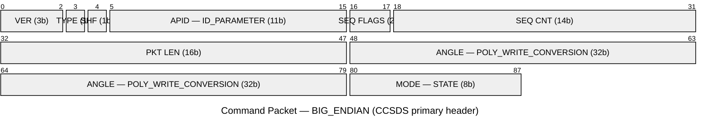

# Summary
`VIEW[**{summary}**][text(renderMarkdown)]`

# Additional Background

## Concepts of Note
2 Components to commands:
1. COMMAND / SELECT_COMMAND
2. COMMAND modifiers 
	1. PARAMETER (optional)
		1. PARAMETER Modifiers (optional)
	2. Other modifiers

󰙎  Command ;;; Packet of information telling a target to perform an action. Commands have a variety of modifiers. = 

- Commands that depend on other commands need to be defined later in the file.

## Syntax
```
COMMAND <TARGET_NAME> <PACKET_NAME> <ENDIANNESS> "<DESCRIPTION>"
```

### Parameters
`APPEND_PARAMETER`
```ruby
COMMAND <TARGET_NAME> <PACKET_NAME> <ENDIANNESS> "<DESCRIPTION>"
	APPEND_PARAMETER <NAME> <BIT_SIZE> <DATA_TYPE> <MIN> <MAX> <DEFAULT> "<DESCRIPTION>" # For int/uint,float, & derived
	APPEND_PARAMETER <NAME> <BIT_SIZE> <STRING/BLOCK> <DEFAULT> "<DESCRIPTION>" # For string/block
```
- If `BIT_SIZE` = 0, then data type must be derived
`PARAMETER`
```ruby
COMMAND <TARGET_NAME> <PACKET_NAME> <ENDIANNESS> "<DESCRIPTION>"
	PARAMETER <NAME> <BIT_SIZE> <DATA_TYPE> <MIN> <MAX> <DEFAULT> "<DESCRIPTION>"
```

#### Parameter modifiers

| Modifier | Category | Purpose |
|---|---|---|
| `STATE` | Display | String label → numeric; `HAZARDOUS` flag requires confirmation |
| `UNITS` | Display | Full name + abbreviation (e.g. `Celsius C`) |
| `FORMAT_STRING` | Display | Printf-style display (e.g. `"0x%0X"`) |
| `DESCRIPTION` | Display | Override description text |
| `REQUIRED` | Validation | Script must supply value; default ignored |
| `MINIMUM_VALUE` | Validation | Override defined minimum |
| `MAXIMUM_VALUE` | Validation | Override defined maximum |
| `DEFAULT_VALUE` | Validation | Override defined default |
| `OVERFLOW` | Validation | `ERROR` \| `ERROR_ALLOW_HEX` \| `TRUNCATE` \| `SATURATE` |
| `POLY_WRITE_CONVERSION` | Conversion | Polynomial transform applied on write |
| `WRITE_CONVERSION` | Conversion | Custom Ruby/Python class on write |
| `HIDDEN` | Visibility | Exclude from tools & script helpers |
| `OBFUSCATE` | Visibility | Mask value in UI, logs, binary files |
| `KEY` | Layout | JSONPath/XPath accessor for structured data |
| `OVERLAP` | Layout | Permit bit overlap with other parameters |
| `META` | Metadata | Arbitrary key-value user metadata |

 `STATE <key> <value> [HAZARDOUS "<desc>"]` ;;; key = display string, value = raw integer; HAZARDOUS requires confirmation in cmd scripts
 `OVERFLOW ERROR|ERROR_ALLOW_HEX|TRUNCATE|SATURATE` ;;; ERROR_ALLOW_HEX permits hex literals outside numeric range
 `POLY_WRITE_CONVERSION <c0> <c1> [c2 ...]` ;;; output = c0 + c1×x + c2×x² + …  (e.g. degrees → radians)
 `WRITE_CONVERSION <ClassName> [param ...]` ;;; CamelCase filename; class receives `(value, packet, buffer)`
 `KEY "<path>"` ;;; JSONPath (`$.field`) or XPath; used with non-binary accessors (JSON, XML)



## Usage
  `COMMAND TAR GET_INFO BIG_ENDIAN "info"` ;;; Create command `GET_INFO` on target `TAR` in cosmos. Use `ENDIAN` that is the default, and description: `info`. = 
  `PARAMETER P 2 16 UINT 0 10 5 "Desc"` ;;; Add parameter called `P` with the following vals: bit offset of 2 from MSB, bit size of 16, and datatype of UINT. Since this is a UINT, we also add: minValue 0, maxValue 10, defaultVal 5, description "desc". = 

## Examples
```ruby
COMMAND SENSOR PING BIG_ENDIAN "Empty command"
# No parameters - 0 bits, 0 bytes

COMMAND SENSOR PING BIG_ENDIAN ""
	APPEND_PARAMETER SYNC 16 UINT16 0 655535 57005 "Sync word"
	# Placed at a bit offset 0. Defaults to 57005 (57005 -convertToHex->0xDEAD)
```

### OpenC3Provided Example


```ruby
COMMAND TARGET COLLECT_DATA BIG_ENDIAN "Commands my target to collect data"
  PARAMETER CCSDSVER 0 3 UINT 0 0 0 "CCSDS PRIMARY HEADER VERSION NUMBER"
  PARAMETER CCSDSTYPE 3 1 UINT 1 1 1 "CCSDS PRIMARY HEADER PACKET TYPE"
  PARAMETER CCSDSSHF 4 1 UINT 0 0 0 "CCSDS PRIMARY HEADER SECONDARY HEADER FLAG"
  ID_PARAMETER CCSDSAPID 5 11 UINT 0 2047 100 "CCSDS PRIMARY HEADER APPLICATION ID"
  PARAMETER CCSDSSEQFLAGS 16 2 UINT 3 3 3 "CCSDS PRIMARY HEADER SEQUENCE FLAGS"
  PARAMETER CCSDSSEQCNT 18 14 UINT 0 16383 0 "CCSDS PRIMARY HEADER SEQUENCE COUNT"
  PARAMETER CCSDSLENGTH 32 16 UINT 4 4 4 "CCSDS PRIMARY HEADER PACKET LENGTH"
  PARAMETER ANGLE 48 32 FLOAT -180.0 180.0 0.0 "ANGLE OF INSTRUMENT IN DEGREES"
    POLY_WRITE_CONVERSION 0 0.01745 0 0
  PARAMETER MODE 80 8 UINT 0 1 0 "DATA COLLECTION MODE"
    STATE NORMAL 0
    STATE DIAG 1
COMMAND TARGET NOOP BIG_ENDIAN "Do Nothing"
  PARAMETER CCSDSVER 0 3 UINT 0 0 0 "CCSDS PRIMARY HEADER VERSION NUMBER"
  PARAMETER CCSDSTYPE 3 1 UINT 1 1 1 "CCSDS PRIMARY HEADER PACKET TYPE"
  PARAMETER CCSDSSHF 4 1 UINT 0 0 0 "CCSDS PRIMARY HEADER SECONDARY HEADER FLAG"
  ID_PARAMETER CCSDSAPID 5 11 UINT 0 2047 101 "CCSDS PRIMARY HEADER APPLICATION ID"
  PARAMETER CCSDSSEQFLAGS 16 2 UINT 3 3 3 "CCSDS PRIMARY HEADER SEQUENCE FLAGS"
  PARAMETER CCSDSSEQCNT 18 14 UINT 0 16383 0 "CCSDS PRIMARY HEADER SEQUENCE COUNT"
  PARAMETER CCSDSLENGTH 32 16 UINT 0 0 0 "CCSDS PRIMARY HEADER PACKET LENGTH"
  PARAMETER DUMMY 48 8 UINT 0 0 0 "DUMMY PARAMETER BECAUSE CCSDS REQUIRES 1 BYTE OF DATA"
COMMAND TARGET SETTINGS BIG_ENDIAN "Set the Settings"
  PARAMETER CCSDSVER 0 3 UINT 0 0 0 "CCSDS PRIMARY HEADER VERSION NUMBER"
  PARAMETER CCSDSTYPE 3 1 UINT 1 1 1 "CCSDS PRIMARY HEADER PACKET TYPE"
  PARAMETER CCSDSSHF 4 1 UINT 0 0 0 "CCSDS PRIMARY HEADER SECONDARY HEADER FLAG"
  ID_PARAMETER CCSDSAPID 5 11 UINT 0 2047 102 "CCSDS PRIMARY HEADER APPLICATION ID"
  PARAMETER CCSDSSEQFLAGS 16 2 UINT 3 3 3 "CCSDS PRIMARY HEADER SEQUENCE FLAGS"
  PARAMETER CCSDSSEQCNT 18 14 UINT 0 16383 0 "CCSDS PRIMARY HEADER SEQUENCE COUNT"
  PARAMETER CCSDSLENGTH 32 16 UINT 0 0 0 "CCSDS PRIMARY HEADER PACKET LENGTH"
  <% 5.times do |x| %>
  APPEND_PARAMETER SETTING<%= x %> 16 UINT 0 5 0 "Setting <%= x %>"
  <% end %>
```

## Media
[OpenC3 Configuration Commands](https://docs.openc3.com/docs/configuration/command)

- [PARAMETER](https://docs.openc3.com/docs/configuration/command#append_parameter) (doesn't compute the offset for you)
- [APPEND_PARAMETER](https://docs.openc3.com/docs/configuration/command#append_parameter) (computes the offset for you)
- [ID_PARAMETER](https://docs.openc3.com/docs/configuration/command#append_parameter)
󰠗 

## Diagrams %% fold %% 
![[openc3 command configuration.png]]

## Flashcards %% fold %% 
󰠗 What are the three
󰠗  What's the primary way you can modify a command in cosmos? ;; With a `PARAMETER`/`APPEND_PARAMETER` = 
󰠗  What fields are required for a `PARAMETER` in a command in cosmos? What if the parameter is *not* a string/block? ;; Name, Bit offset, bit size, datatype, default value.
      If the parameter is an int/float/uint/derived, additional required parameters are: minimum value, maximum value, and default value. = 

󰠗  What fields are required for a `PARAMETER` in a command in cosmos? What if the parameter is a string/block? ;; Name, Bit offset, bit size, datatype, default value.
      If the parameter is a string/block, additional required parameters are: default value. = 
