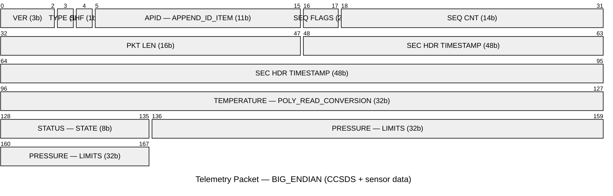

# Summary
`VIEW[**{summary}**][text(renderMarkdown)]`

# Additional Background
## Concepts of Note
Components to telemetry:
1. TELEMETRY (or SELECT_TELEMETRY)
2. TELEMETRY modifiers
	1. ITEM (or ID_ITEM)
		1. ITEM Modifiers
3. LIMITS_GROUP

󰙎  Telemetry packet ;;; Packet of information providing status from a target = #tools/openc3/targets/telemetry 
- Variable sized
- Derived items
	- Telemetry items that don't exist in the binary data, but typically computed based on other telemetry items.
- Received time vs packet time
	- received time is when COSMOS receives the packet. Packet time defaults to received time, but can be set in other ways.

## Syntax

```
TELEMETRY <TARGET> <PACKET> <ENDIANNESS> "<DESCRIPTION>"
    APPEND_ITEM    <NAME> <BIT_SIZE>             <DATA_TYPE>          "<DESC>"
    ITEM           <NAME> <BIT_OFFSET> <BIT_SIZE> <DATA_TYPE>          "<DESC>"
    ID_ITEM        <NAME> <BIT_OFFSET> <BIT_SIZE> <DATA_TYPE> <ID_VAL> "<DESC>"
    APPEND_ID_ITEM <NAME> <BIT_SIZE>             <DATA_TYPE> <ID_VAL> "<DESC>"
```

### Item types

| Keyword | Bit Offset | ID Value | Notes |
|---|---|---|---|
| `ITEM` | explicit | — | Fixed-position field |
| `APPEND_ITEM` | auto | — | Sequential; preferred |
| `ID_ITEM` | explicit | required | Matches incoming packet to this definition |
| `APPEND_ID_ITEM` | auto | required | Sequential ID field |
| `ARRAY_ITEM` | explicit | — | Fixed array; adds `<item_size> <array_total_bits>` params |
| `APPEND_ARRAY_ITEM` | auto | — | Sequential array |

- [p] `ITEM <name> <bit_offset> <bit_size> <INT|UINT|FLOAT|STRING|BLOCK|DERIVED> "<desc>"` ;;; negative offset = from packet end; bit_size 0 → DERIVED only
- [p] `APPEND_ITEM <name> <bit_size> <type> "<desc>"` ;;; auto-computes offset after previous item; use for sequential layouts
- [p] `APPEND_ARRAY_ITEM <name> <item_bit_size> <type> <array_bit_size> "<desc>"` ;;; array_bit_size = total bits for all elements combined

### Item modifiers

| Modifier | Category | Purpose |
|---|---|---|
| `STATE` | Display | String label → numeric; optional color (GREEN/YELLOW/RED) |
| `UNITS` | Display | Measurement units |
| `FORMAT_STRING` | Display | Printf-style display format |
| `DESCRIPTION` | Display | Override description |
| `LIMITS` | Limits | RED/YELLOW/GREEN thresholds with persistence |
| `LIMITS_RESPONSE` | Limits | Custom action on limit violation |
| `READ_CONVERSION` | Conversion | Custom Ruby/Python class on read |
| `POLY_READ_CONVERSION` | Conversion | Polynomial transform on read |
| `SEG_POLY_READ_CONVERSION` | Conversion | Piecewise polynomial by value range |
| `GENERIC_READ_CONVERSION_START/END` | Conversion | Inline Ruby/Python block |
| `CONVERTED_DATA` | Conversion | Post-conversion type spec (required for DERIVED) |
| `VARIABLE_BIT_SIZE` | Layout | Item size driven by another item's value |
| `OVERLAP` | Layout | Allow bit overlap without warning |
| `KEY` | Layout | JSONPath/XPath accessor |
| `HIDDEN` | Visibility | Exclude from all tools; skips decom |
| `OBFUSCATE` | Visibility | Mask in UI & logs |
| `META` | Metadata | Arbitrary key-value metadata |

- [p] `STATE <key> <value> [GREEN|YELLOW|RED]` ;;; color drives TlmViewer display; RED/YELLOW set limit state
- [p] `LIMITS DEFAULT <persistence> ENABLED <red_lo> <yel_lo> <yel_hi> <red_hi> [grn_lo grn_hi]` ;;; persistence = consecutive out-of-range samples before state change
- [p] `POLY_READ_CONVERSION <c0> <c1> [c2 ...]` ;;; output = c0 + c1×raw + c2×raw² + …
- [p] `VARIABLE_BIT_SIZE <length_item> [bits_per_count=8] [bit_offset=0]` ;;; length_item must be defined earlier in same packet
- [p] `CONVERTED_DATA <bit_size> <INT|UINT|FLOAT|STRING|BLOCK> [array_bit_size]` ;;; defines post-conversion structure for DERIVED items



### Packet-level modifiers

| Modifier | Purpose |
|---|---|
| `ALLOW_SHORT` | Accept packets smaller than defined; zero-fill remainder |
| `ACCESSOR` | Custom raw value extractor (default: `BinaryAccessor`) |
| `PROCESSOR` | Run custom code on every packet reception |
| `IGNORE_OVERLAP` | Suppress all item overlap warnings for this packet |
| `CATCHALL` | Catch-all packet; suppresses missing ID_ITEM warning |
| `VIRTUAL` | Exclude from ID matching; usable as structure template |
| `SUBPACKET` | Mark as subpacket; skip interface-level identification |

## Usage

## Diagrams

![[openc3 telemetry configuration.png]]
